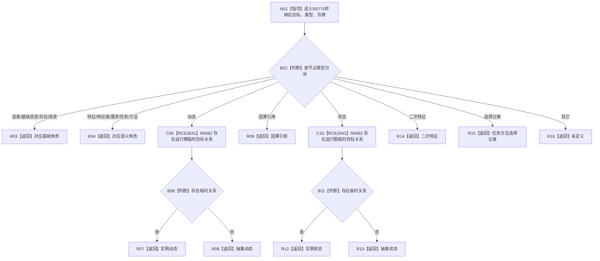

# CF-L12-0056 识别节点角色已许可现状流程图

图类型：现状流程图
代码版本：`03a8b7ac099ccea83e57f2696e2290b7bcdfacaf`
当前工作区复核基线：`ef4f7bda76c92c0eb11456cfa267d76f35810616`
源码 blob：`ccde9a574e3817b75e3d02c9c8f88e244327c06a`
覆盖文件：`海中鱼巣/领域/数据操作.语素基础.ixx:482-507`
唯一根函数：R0770
完整签名：`语义节点角色 海中鱼巣::语素基础数据操作::识别节点角色_已许可(节点句柄 目标, 节点类型 类型, const 结构事务令牌& 令牌) const`
参数：目标与类型值传递；令牌只读引用
返回结果：按节点类型返回角色；动态和状态再按运行期临时关系区分实例或抽象；默认未定义
调用图：`流程图/主程序可达调用关系/00_main可达函数身份表.md`、`01_main可达项目调用边表.md`、`02_main可达外部边界表.md`
已登记调用方：R0771
直接项目函数：R0082（RCE2641，调用两次）
外部边界：无
逐行映射表：`流程图/代码流程图/L12/CF-L12-0056_识别节点角色已许可_逐行代码映射表.md`
输入契约 / 调用语境表：本图内嵌审查；已许可身份读取按节点类型识别语义角色
非成功返回二分审查表：本图内嵌审查；未支持类型返回未定义
偏差清单：无独立文件；本批只记录当前代码事实
依据提交 / 结构化消息：冻结源码提交 `03a8b7ac099ccea83e57f2696e2290b7bcdfacaf`、正式图谱与顶层稳定边裁决
验证输出：Mermaid / 节点集合 / 逐行覆盖 PASS；目标 no-index 检查 PASS；未构建、未运行
不得作为施工许可：是
不得宣称：角色分类已经完成业务验收

## 流程图

## 当前边界

- 动态与状态分支各调用一次 R0082，其余类型直接返回枚举。
