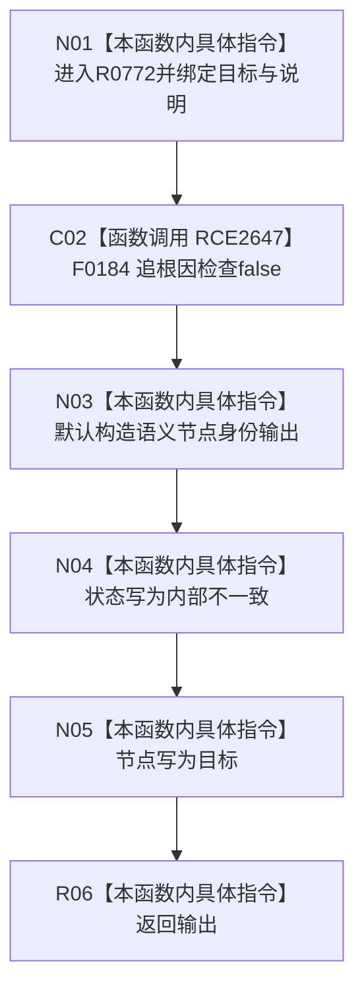

# CF-L12-0057 语素基础数据操作身份内部不一致现状流程图

图类型：现状流程图
代码版本：`03a8b7ac099ccea83e57f2696e2290b7bcdfacaf`
当前工作区复核基线：`9fda64b1f2330996913d09dd314fc498303d3e54`
源码 blob：`ccde9a574e3817b75e3d02c9c8f88e244327c06a`
覆盖文件：`海中鱼巣/领域/数据操作.语素基础.ixx:535-541`
唯一根函数：R0772
完整签名：`语义节点身份 海中鱼巣::语素基础数据操作::身份内部不一致(节点句柄 目标, const wchar_t* 说明) const`
参数：目标节点句柄与用于追根因检查的说明文本
返回结果：状态固定为内部不一致、节点固定为目标的语义节点身份
调用图：`流程图/主程序可达调用关系/00_main可达函数身份表.md`、`01_main可达项目调用边表.md`、`02_main可达外部边界表.md`
已登记调用方：R0771（RCE2645）
直接项目函数：F0184（RCE2647）
外部边界：无
结构读写：只写局部输出的状态和节点，不修改仓库
逐行映射表：`流程图/代码流程图/L12/CF-L12-0057_语素基础数据操作身份内部不一致_逐行代码映射表.md`
不得作为施工许可：是
不得宣称：追根因检查已经修复内部不一致，或返回材料已经证明目标节点存在

## 流程图

## 当前边界

- 本函数记录并包装不一致，不读回节点、主键或主信息，也不改变任何持久结构。
