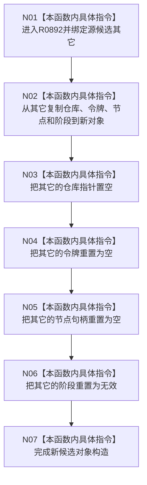

# CF-L12-0058 节点未发布候选移动构造现状流程图

图类型：现状流程图
代码版本：`03a8b7ac099ccea83e57f2696e2290b7bcdfacaf`
当前工作区复核基线：`00d917a5cf09998d2ab14d9239e1c194b5593ff0`
源码 blob：`9f8ef9a14937b13af5f31f9c8fc3457dd0078ead`
覆盖文件：`海中鱼巣/核心/节点仓库.h:29-35`
唯一根函数：R0892
完整签名：`海中鱼巣::节点未发布候选::节点未发布候选(海中鱼巣::节点未发布候选&& 其它) noexcept`
参数：`其它` 为待移动的节点未发布候选右值引用；调用后保持可析构但被显式置为无效
返回结果：构造函数无独立返回值；新对象接收仓库、令牌、节点和阶段，源对象全部关键字段重置
调用图：正式 main 可达关系表
已登记调用方：R0745（RCE3328）、R0746（RCE3330）
直接项目函数：无
外部边界：无
逐行映射表：`流程图/代码流程图/L12/CF-L12-0058_节点未发布候选移动构造_逐行代码映射表.md`
不得作为施工许可：是
不得宣称：移动构造完成证明候选完整、已经确认或已经发布

## 流程图

## 当前边界

- 本移动构造把资源身份转移到新对象，并主动使源候选失效；它不调用仓库发布或撤销入口。
