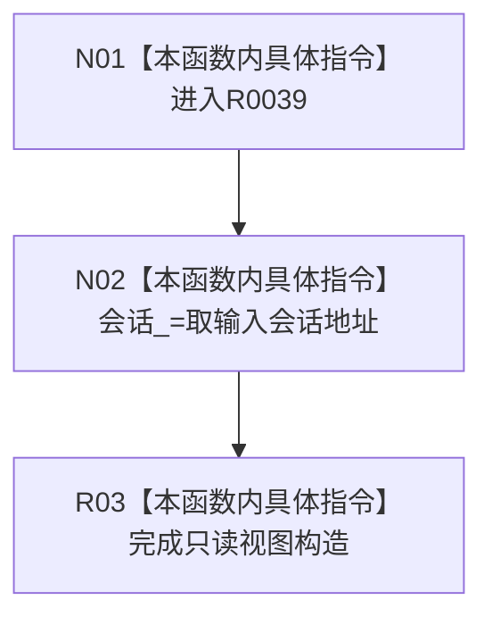

# CF-L13-0001 结构提交准备只读视图构造现状流程图

图类型：现状流程图
代码版本：`3920a74638264f9f539d50f32f3c9fe5fb1982ab`
源码 blob：`df70de9c299c74f7f0766a3e94facaf504f57968`
覆盖文件：`海中鱼巣/核心/会话.结构写入.ixx:63`
唯一根函数：R0039
完整签名：`explicit 海中鱼巣::结构提交准备只读视图::结构提交准备只读视图(const 海中鱼巣::结构写入会话& 会话)`
参数：会话为只读借用
返回结果：构造完成的只读视图，其内部指针借用输入会话
直接项目函数：无
外部边界：无
调用图：`流程图/主程序可达调用关系/01_main可达项目调用边表.md`
逐行映射表：`流程图/代码流程图/L13/CF-L13-0001_结构提交准备只读视图构造_逐行代码映射表.md`
偏差清单：无；结构变化：新视图的 `会话_` 指针设为输入会话地址
验证输出：63 行完整映射；不得作为施工许可：是；不得宣称：只读视图延长会话生命周期

## 流程图

