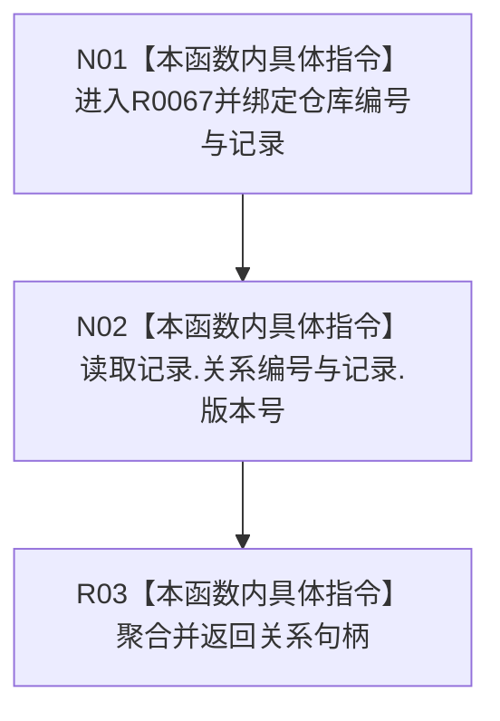

# CF-L13-0002 形成关系句柄现状流程图

图类型：现状流程图
代码版本：`176b674a6c1499ccdd7306f30f910fec6dc5079c`
源码 blob：`f7a9ea9a09d3065468208c16f9ea34f806b6e183`
覆盖文件：`海中鱼巣/核心/关系仓库.cpp:112-114`
唯一根函数：R0067
完整签名：`关系句柄 海中鱼巣::{匿名命名空间@关系仓库.cpp}::形成关系句柄(std::uint64_t 仓库编号, const 关系记录& 记录)`
参数：仓库编号按值；记录为只读借用
返回结果：由仓库编号、记录.关系编号和记录.版本号聚合形成的关系句柄
直接项目函数：无；外部边界：无；未解析调用：0
调用图：`流程图/主程序可达调用关系/01_main可达项目调用边表.md`
逐行映射表：`流程图/代码流程图/L13/CF-L13-0002_形成关系句柄_逐行代码映射表.md`
输入契约 / 调用语境表：调用方提供仓库编号与关系记录；非成功返回二分审查表：无
偏差清单：无；依据提交 / 结构化消息：当前源码、RCE0440 的三个调用点
验证输出：112—114 行完整映射；不得作为施工许可：是
不得宣称：聚合出的句柄已经通过有效性、仓库存在性或版本当前性复核

## 流程图

