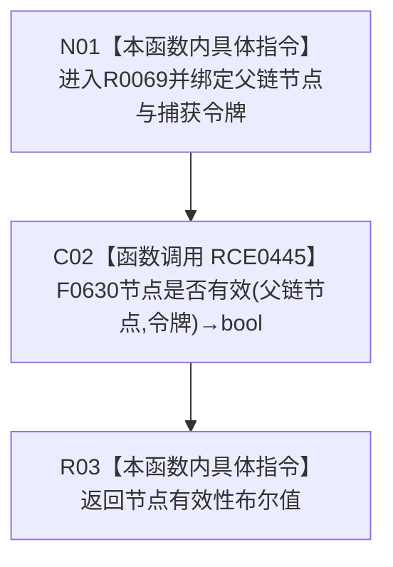

# CF-L13-0003 关系仓库结构化挂载或重挂节点父链节点检查现状流程图

图类型：现状流程图
代码版本：`176b674a6c1499ccdd7306f30f910fec6dc5079c`
源码 blob：`f7a9ea9a09d3065468208c16f9ea34f806b6e183`
覆盖文件：`海中鱼巣/核心/关系仓库.cpp:1253-1255`
唯一根函数：R0069
完整签名：`bool 海中鱼巣::关系仓库::结构化挂载或重挂节点(海中鱼巣::节点句柄, 海中鱼巣::节点句柄, const 海中鱼巣::结构事务令牌&)::<lambda@关系仓库.cpp:1253>::operator()(const 海中鱼巣::节点句柄& 父链节点) const`
参数：父链节点为只读借用；lambda 捕获关系仓库 `this` 与外层只读令牌
返回结果：带令牌节点有效性布尔值
直接项目函数：RCE0445→F0630；外部边界：无；未解析调用：0
调用图：`流程图/主程序可达调用关系/01_main可达项目调用边表.md`
逐行映射表：`流程图/代码流程图/L13/CF-L13-0003_关系仓库结构化挂载或重挂节点父链节点检查_逐行代码映射表.md`
输入契约 / 调用语境表：R0068 经 RCE0438 把本 lambda 交给 `std::all_of`；非成功返回二分审查表：R03=false
偏差清单：无；依据提交 / 结构化消息：当前源码、RCE0438、RCE0445
验证输出：1253—1255 行完整映射；不得作为施工许可：是
不得宣称：单个父链节点有效等于整条父链无环或结构一致

## 流程图

