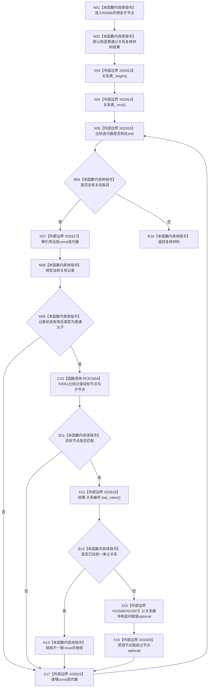

# CF-L13-0004 关系仓库复核普通父关系已加锁现状流程图

图类型：现状流程图
代码版本：`7ad8cf5113162fe92b9f8d43f2b5b9f00d292d1a`
源码事实提交：`3920a74638264f9f539d50f32f3c9fe5fb1982ab`
源码 blob：`f7a9ea9a09d3065468208c16f9ea34f806b6e183`
覆盖文件：`海中鱼巣/核心/关系仓库.cpp:683-700`
唯一根函数：R0086
完整签名：`海中鱼巣::关系仓库::普通父关系复核材料 海中鱼巣::关系仓库::复核普通父关系_已加锁(海中鱼巣::节点句柄 子节点) const`
参数：子节点按值传入；`this` 为 const 非拥有借用；调用方负责已持有仓库锁
返回结果：返回首个有效普通父关系的关系编号和父节点；发现第二条匹配关系时附带结构不一致标志
已登记调用方：R0068/R0087，经 RCE0436/RCE0495
直接项目函数：RCE0494→F0051
外部边界：X01507/X01508/X01509/X02913/X02914/X02915/X02916/X02917/X02918
未解析项目调用：0
逐行映射表：`流程图/代码流程图/L13/CF-L13-0004_关系仓库复核普通父关系已加锁_逐行代码映射表.md`
结构读取与写入：只读关系表并写局部复核材料，零仓库结构变化
验证输出：683—700 行完整映射；2 条项目入边、1 条项目出边、9 个外部边界
不得作为施工许可：是
不得宣称：函数自行取得锁、校验父节点有效性或修复重复父关系

## 流程图

## 当前边界

- 函数名中的“已加锁”是调用前置；本函数不建立锁边界。
- 首条匹配关系写入局部结果；第二条及后续匹配只把局部 `结构不一致` 设为 true，不修改关系表。
