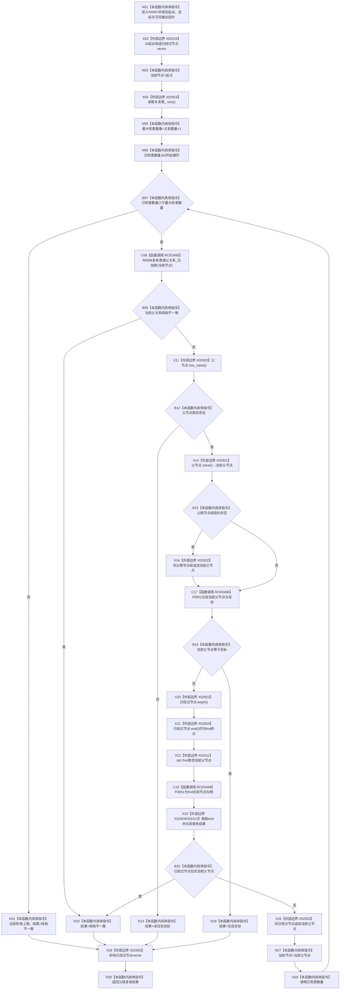

# CF-L13-0005 关系仓库复核父链已加锁现状流程图

图类型：现状流程图
代码版本：`7ad8cf5113162fe92b9f8d43f2b5b9f00d292d1a`
源码事实提交：`3920a74638264f9f539d50f32f3c9fe5fb1982ab`
源码 blob：`f7a9ea9a09d3065468208c16f9ea34f806b6e183`
覆盖文件：`海中鱼巣/核心/关系仓库.cpp:702-731`
唯一根函数：R0087
完整签名：`海中鱼巣::关系仓库::父链复核结果 海中鱼巣::关系仓库::复核父链_已加锁(海中鱼巣::节点句柄 起点, 海中鱼巣::节点句柄 目标, std::vector<海中鱼巣::节点句柄>* 父链节点组) const`
参数：起点和目标按值传入；父链节点组为可空、非拥有输出指针；`this` 为 const 非拥有借用；调用方负责已持有仓库锁
返回结果：返回包含目标、未包含目标或结构不一致；非空父链节点组按遍历顺序追加实际经过的父节点
已登记调用方：R0068，经 RCE0437
直接项目函数：RCE0495→R0086、RCE0496→F0051
外部边界：X01510/X01511/X01512/X02919/X02920/X02921/X02922/X02923/X02924/X02925
未解析项目调用：0
逐行映射表：`流程图/代码流程图/L13/CF-L13-0005_关系仓库复核父链已加锁_逐行代码映射表.md`
结构读取与写入：只读关系表；可追加调用方提供的父链节点组；零仓库结构变化
验证输出：702—731 行完整映射；1 条项目入边、2 条项目出边、10 个外部边界
不得作为施工许可：是
不得宣称：函数自行取得锁、修复父链，或结构不一致结果已经完成追根因治理

## 流程图

## 当前边界

- 最大检查数量为当前关系记录数量加一；达到上限仍未收口时返回结构不一致。
- 输出指针为空不会阻止复核；非空时只追加已走到的父节点，不清空调用方已有内容。
- X02925 覆盖局部访问集合在全部返回与异常清理路径上的生命周期。
