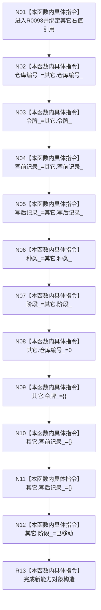

# CF-L13-0006 已发布关系变更能力移动构造现状流程图

图类型：现状流程图
代码版本：`3920a74638264f9f539d50f32f3c9fe5fb1982ab`
源码 blob：`0628ee4ade067238e826b26753d806c05b507764`
覆盖文件：`海中鱼巣/核心/关系仓库.h:42-50`
唯一根函数：R0093
完整签名：`海中鱼巣::已发布关系变更能力::已发布关系变更能力(海中鱼巣::已发布关系变更能力&& 其它) noexcept`
参数：`其它` 为可写右值引用；调用方保证对象在调用期间存活，构造后其业务载荷被清空并进入已移动阶段
返回结果：无显式返回值；完成一个持有原载荷的新能力对象构造
已登记调用方：RCE0444（R0068 在 `关系仓库.cpp:1355` 向 `optional` 存储移动局部能力）
直接项目函数：无
外部边界：无；未解析项目调用：0
调用图：`流程图/主程序可达调用关系/01_main可达项目调用边表.md`
逐行映射表：`流程图/代码流程图/L13/CF-L13-0006_已发布关系变更能力移动构造_逐行代码映射表.md`
偏差清单：无；当前实现以逐字段值复制后显式清空源对象完成移动
依据提交 / 结构化消息：当前源码、RCE0444
结构读取与写入：写新对象六个成员；清空源对象仓库编号、令牌、写前/写后记录并把源阶段写为已移动
逻辑内返回：不适用
生命周期与资源释放：不延长源对象生命周期；源对象仍可析构但不再持有有效能力载荷
异常：函数声明 `noexcept`；登记字段均按当前值类型处理
验证输出：42—50 行完整映射；1 条项目入边、0 条项目出边、0 个外部边界
不得作为施工许可：是
不得宣称：移动后源对象仍可确认或撤销关系变更

## 流程图

## 当前边界

- RCE0444 的实参为 `其它=std::move(能力)`，结果是 `输出.能力` 中的新对象。
- 当前图不把平凡字段复制、清零或默认值赋值另行登记为项目函数或外部边界。
