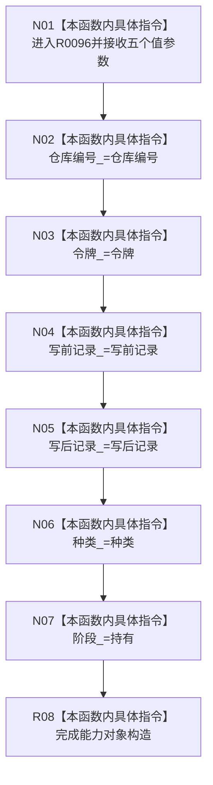

# CF-L13-0007 已发布关系变更能力构造现状流程图

图类型：现状流程图
代码版本：`3920a74638264f9f539d50f32f3c9fe5fb1982ab`
源码 blob：`0628ee4ade067238e826b26753d806c05b507764`
覆盖文件：`海中鱼巣/核心/关系仓库.h:65-73`
唯一根函数：R0096
完整签名：`海中鱼巣::已发布关系变更能力::已发布关系变更能力(std::uint64_t 仓库编号, 海中鱼巣::结构事务令牌 令牌, 海中鱼巣::关系记录 写前记录, 海中鱼巣::关系记录 写后记录, 海中鱼巣::已发布关系变更种类 种类) noexcept`
参数：五个参数均按值传入；构造期间复制到新对象成员，不借用调用方对象
返回结果：无显式返回值；完成一个阶段为 `持有` 的关系变更能力对象构造
已登记调用方：RCE0442（R0068，`关系仓库.cpp:1340-1341`）
调用实参：`仓库编号_`、当前 `令牌`、局部 `写前记录`、局部 `写后记录`、`已发布关系变更种类::重挂`
直接项目函数：无
外部边界：无；未解析项目调用：0
调用图：`流程图/主程序可达调用关系/01_main可达项目调用边表.md`
逐行映射表：`流程图/代码流程图/L13/CF-L13-0007_已发布关系变更能力构造_逐行代码映射表.md`
偏差清单：无；本构造函数为私有，当前由友元关系仓库调用
依据提交 / 结构化消息：当前源码、RCE0442
结构读取与写入：写新对象仓库编号、令牌、写前记录、写后记录、种类和阶段；不写仓库
逻辑内返回：不适用
生命周期与资源释放：新对象独立保存五个值参数；不取得仓库或事务状态所有权
异常：函数声明 `noexcept`
验证输出：65—73 行完整映射；1 条项目入边、0 条项目出边、0 个外部边界
不得作为施工许可：是
不得宣称：构造完成证明关系变更已经确认、撤销或最终发布

## 流程图

## 当前边界

- RCE0442 的结果绑定局部变量 `能力`，初始阶段固定为 `持有`。
- 当前图不把平凡值复制或枚举赋值另行登记为项目函数或外部边界。
