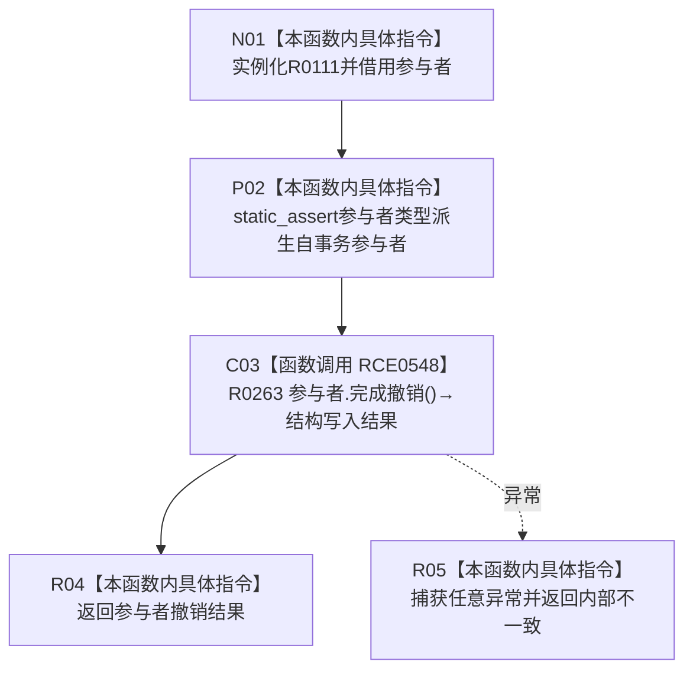

# CF-L13-0008 结构写入执行器安全完成参与者撤销现状流程图

图类型：现状流程图
代码版本：`73cc1af758e041519fa27c1dd57b9d5d07e3405a`
源码事实提交：`3920a74638264f9f539d50f32f3c9fe5fb1982ab`
源码 blob：`292e602cef1dd658ac2b507a3cc9ced7270a4a86`
覆盖文件：`海中鱼巣/核心/执行器.结构写入.ixx:409-417`
唯一根函数：R0111
完整签名：`template <typename 参与者类型> static 海中鱼巣::结构写入结果 海中鱼巣::结构写入执行器::安全完成参与者撤销(参与者类型& 参与者) noexcept`
参数：`参与者` 为非拥有可写引用；当前可达实例的类型为 `结构写入事务参与者`
返回结果：返回 R0263 的撤销结果；任意异常被折叠为 `内部不一致`
已登记调用方：R0109，经 RCE0545
直接项目函数：RCE0548→R0263
外部边界：无
未解析项目调用：0
逐行映射表：`流程图/代码流程图/L13/CF-L13-0008_结构写入执行器安全完成参与者撤销_逐行代码映射表.md`
结构读取与写入：委托当前唯一可达参与者完成撤销；异常只形成值式内部不一致
验证输出：409—417 行完整映射；1 条项目入边、1 条项目出边、0 个外部边界
不得作为施工许可：是

## 流程图

## 当前边界

- 当前唯一可达真实参与者为 `特征值原始材料事务参与者`；RCE0548 已解析到其 R0263。
- 本函数为 `noexcept`，参与者异常不会越过本函数，统一转换为结构写入内部不一致结果。
