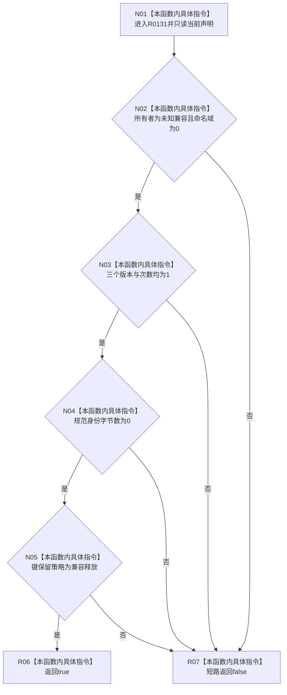

# CF-L13-0010 索引所有者声明未知兼容完整现状流程图

图类型：现状流程图
代码版本：`73cc1af758e041519fa27c1dd57b9d5d07e3405a`
源码 blob：`ecdd8b7888aeda86fce1ba8bc02e40b5cfa282aa`
覆盖文件：`海中鱼巣/核心/索引所有权.数据.h:42-46`
唯一根函数：R0131
完整签名：`bool 海中鱼巣::索引所有者声明::未知兼容完整() const noexcept`
参数：无显式参数；只读 `this` 指向的索引所有者声明
返回结果：八项未知兼容合同条件全部成立时返回 `true`，否则返回 `false`
已登记调用方：RCE0594（R0128，`索引所有权.数据.h:104`）
直接项目函数：无
外部边界：无；未解析项目调用：0
调用图：`流程图/主程序可达调用关系/01_main可达项目调用边表.md`
逐行映射表：`流程图/代码流程图/L13/CF-L13-0010_索引所有者声明未知兼容完整_逐行代码映射表.md`
偏差清单：无
依据提交 / 结构化消息：当前源码、RCE0594
结构读取与写入：只读声明全部七个字段；不写结构
逻辑内返回：任一未知兼容条件不成立时返回 `false`
生命周期与资源释放：不取得资源
异常：函数声明 `noexcept`
验证输出：42—46 行完整映射；1 条项目入边、0 条项目出边、0 个外部边界
不得作为施工许可：是
不得宣称：返回 `true` 证明该声明属于显式所有者

## 流程图

## 当前边界

- 本函数精确检查未知兼容声明的全部七个字段。
- `&&` 按源码顺序短路；没有项目函数或外部函数调用。
