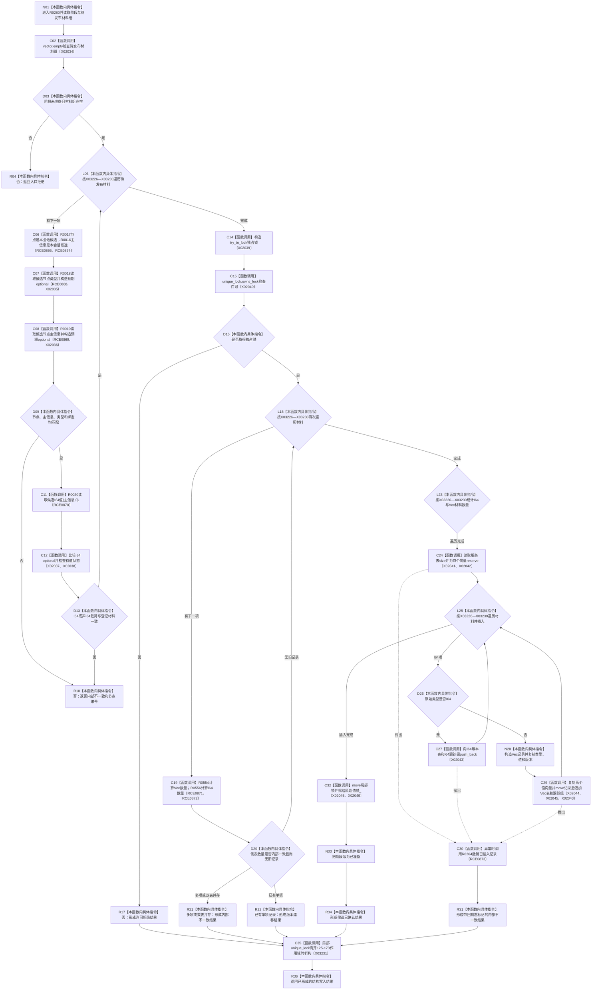

# CF-L13-0011 准备原始材料提交现状流程图

图类型：现状流程图
代码版本：`3920a74638264f9f539d50f32f3c9fe5fb1982ab`
源码 blob：`d82fa092a2c1156d2f8de758d5e32415cb64931d`
覆盖文件：`海中鱼巣/领域/参与者.特征值原始材料.ixx:105-173`
唯一根函数：R0260
完整签名：`海中鱼巣::结构写入结果 海中鱼巣::特征值原始材料事务参与者::准备提交(const 海中鱼巣::结构提交准备只读视图& 视图) override`
参数：提交准备只读视图以 const 引用借用；读取已登记材料和服务侧表并持有侧表独占锁
返回结果：入口不满足、候选不一致、许可竞争、版本漂移或插入异常时返回对应结构写入结果；全部候选插入后返回候选已确认
已登记调用方：R0110（RCE0547）
直接项目函数：R0017（RCE0866）、R0016（RCE0867）、R0018（RCE0868）、R0019（RCE0869）、R0020（RCE0870）、R0554（RCE0871）、R0556（RCE0872）、R0264（RCE0873）
外部边界：X02034—X02046、X03226—X03231；未解析项目调用：0
调用图：`流程图/主程序可达调用关系/01_main可达项目调用边表.md`
逐行映射表：`流程图/代码流程图/L13/CF-L13-0011_准备原始材料提交_逐行代码映射表.md`
偏差清单：无
依据：RCE0547、RCE0866—RCE0873、X02034—X02046、X03226—X03231 与冻结源码
结构读取与写入：复核会话候选后在独占锁下向 I64/Vec 侧表插入记录，保存撤销跟踪和锁所有权并把阶段写为已准备
逻辑内返回：入口拒绝、许可拒绝和版本漂移；候选或回前态不一致为内部不一致
不得作为施工许可：是
不得宣称：候选已完成最后发布或已对无锁读取可见

## 流程图

## 当前边界

- 取得独占锁前只读会话候选；取得锁后才复核和写入侧表。
- 所有在第 125 行构造局部锁之后的退出路径都经 X03231 析构；成功路径先把锁所有权移动到参与者成员。
