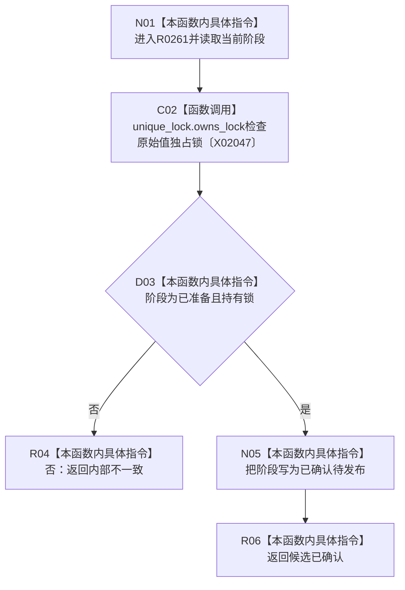

# CF-L13-0012 确认原始材料待发布现状流程图

图类型：现状流程图
代码版本：`3920a74638264f9f539d50f32f3c9fe5fb1982ab`
源码 blob：`d82fa092a2c1156d2f8de758d5e32415cb64931d`
覆盖文件：`海中鱼巣/领域/参与者.特征值原始材料.ixx:175-181`
唯一根函数：R0261
完整签名：`海中鱼巣::结构写入结果 海中鱼巣::特征值原始材料事务参与者::确认待发布() override`
参数：无显式参数；读取参与者阶段和已持有的原始值独占锁
返回结果：阶段或锁不一致时返回内部不一致；否则转为已确认待发布并返回候选已确认
已登记调用方：R0112（RCE0549）
直接项目函数：无
外部边界：X02047；未解析项目调用：0
调用图：`流程图/主程序可达调用关系/01_main可达项目调用边表.md`
逐行映射表：`流程图/代码流程图/L13/CF-L13-0012_确认原始材料待发布_逐行代码映射表.md`
偏差清单：无
依据：RCE0549、X02047 与冻结源码
结构读取与写入：读取锁所有权并把参与者阶段写为已确认待发布
逻辑内返回：无；入口状态或锁不一致按当前代码返回内部不一致
不得作为施工许可：是
不得宣称：事务已发布或原始值已经对普通读取可见

## 流程图

## 当前边界

- 本函数不释放锁，也不执行最后发布。
