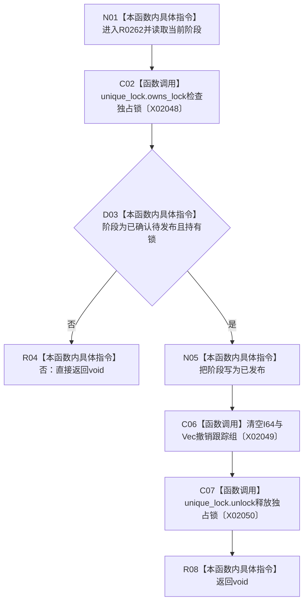

# CF-L13-0013 完成原始材料发布现状流程图

图类型：现状流程图
代码版本：`3920a74638264f9f539d50f32f3c9fe5fb1982ab`
源码 blob：`d82fa092a2c1156d2f8de758d5e32415cb64931d`
覆盖文件：`海中鱼巣/领域/参与者.特征值原始材料.ixx:183-189`
唯一根函数：R0262
完整签名：`void 海中鱼巣::特征值原始材料事务参与者::完成发布() noexcept override`
参数：无显式参数；读取参与者阶段、独占锁和撤销跟踪组
返回结果：`void`；前置不满足时直接返回，满足时标记已发布、清空跟踪组并释放锁
已登记调用方：R0113（RCE0550）
直接项目函数：无
外部边界：X02048—X02050；未解析项目调用：0
调用图：`流程图/主程序可达调用关系/01_main可达项目调用边表.md`
逐行映射表：`流程图/代码流程图/L13/CF-L13-0013_完成原始材料发布_逐行代码映射表.md`
偏差清单：无
依据：RCE0550、X02048—X02050 与冻结源码
结构读取与写入：标记参与者已发布，清空两组撤销跟踪节点并释放独占锁；已插入服务记录保持存在
逻辑内返回：阶段或锁前置不满足时无结果返回
不得作为施工许可：是
不得宣称：事务执行器已完成所有参与者的最后发布

## 流程图

## 当前边界

- 清空的是撤销跟踪组，不删除已发布的原始值记录。
