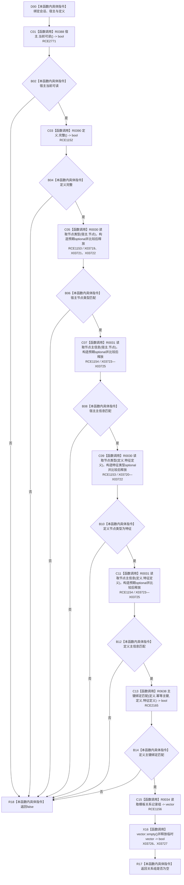

# CF-L13-0014 特征体系验证宿主定义会话现状流程图

图类型：现状流程图
代码版本：`3920a74638264f9f539d50f32f3c9fe5fb1982ab`
源码 blob：`a47cd9b07794d30abc6cb9d1df319056105cd596`
覆盖文件：`海中鱼巣/领域/数据操作.特征体系.ixx:1458-1469`
唯一根函数：R0359
完整签名：`static bool 海中鱼巣::特征体系数据操作::验证宿主定义_会话(结构写入会话& 会话, const 特征节点身份& 宿主, const 特征定义值式材料& 定义)`
参数：`会话` 为只读检查所用结构写入会话引用；`宿主`、`定义` 为待核对值式材料
返回结果：宿主、定义及其会话内节点类型、主信息、主键绑定和模板关系全部符合预期时返回 true，否则按短路顺序返回 false
已登记调用方：R0391（RCE1237）
直接项目函数：R0388（RCE2771）、R0390（RCE1152）、R0030（RCE1153，2 次）、R0031（RCE1154，2 次）、R0638（RCE2165）、R0034（RCE1156）；RCE1155 误绑 R0040，停用
外部边界：X03719—X03727；三种 `std::optional<T>` 值构造特化、两类 `std::operator==`、两类 `std::optional<T>` 析构、`std::vector<关系记录>::empty()` 与 `std::vector<关系记录>::~vector()`
未解析项目调用：0
逐行映射表：`流程图/代码流程图/L13/CF-L13-0014_特征体系验证宿主定义会话_逐行代码映射表.md`
依据：关系发布基线、冻结源码、RCE1155 重载误绑停用裁决与 RCE2771
结构读取与写入：只读宿主、定义及会话内节点、主信息、索引和关系；不改变结构
逻辑内返回：任一验证条件不成立时返回 false，由调用方 R0391 归为版本漂移并停止本轮写入
内部错误边界：无
不得作为施工许可：是
不得宣称：返回 true 代表材料已在事务外重新读回或已完成发布

## 流程图

## 当前边界

- 第 1462 行的 `宿主.当前可读()` 静态接收者是 `特征节点身份`，唯一匹配 R0388；该直接项目边在原聚合中缺失。
- 第 1467 行是双参数 R0638；RCE1155 指向单参数 R0040，属于重载误绑并停用。
- 第 1463—1466 行每个比较都产生一个仓库读取返回 optional 和一个预期值 optional；两者在完整表达式结束时析构。
