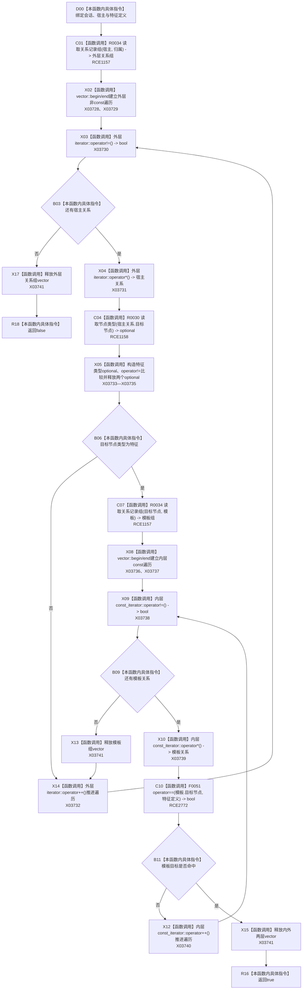

# CF-L13-0015 特征体系存在宿主定义槽位会话现状流程图

图类型：现状流程图
代码版本：`3920a74638264f9f539d50f32f3c9fe5fb1982ab`
源码 blob：`a47cd9b07794d30abc6cb9d1df319056105cd596`
覆盖文件：`海中鱼巣/领域/数据操作.特征体系.ixx:1471-1484`
唯一根函数：R0360
完整签名：`static bool 海中鱼巣::特征体系数据操作::存在宿主定义槽位_会话(结构写入会话& 会话, 节点句柄 宿主, 节点句柄 特征定义)`
参数：`会话` 为只读检查所用结构写入会话引用；`宿主` 与 `特征定义` 为待查节点句柄
返回结果：存在一条宿主归属到特征槽位且该槽位有模板关系指向给定特征定义时返回 true；遍历完成未命中时返回 false
已登记调用方：R0391（RCE1238）
直接项目函数：R0034（RCE1157，2 次）、R0030（RCE1158）、F0051（RCE2772）
外部边界：X03728—X03741；外层非 const `iterator` 五类、optional 三类、内层 `const_iterator` 五类、vector 析构一类
未解析项目调用：0
逐行映射表：`流程图/代码流程图/L13/CF-L13-0015_特征体系存在宿主定义槽位会话_逐行代码映射表.md`
依据：关系发布基线、冻结源码与 RCE2772
结构读取与写入：只读会话内归属关系、节点类型和模板关系；不改变结构
逻辑内返回：命中返回 true，遍历完成未命中返回 false；两者都是存在性查询的正常结果
内部错误边界：无
不得作为施工许可：是
不得宣称：返回 false 代表仓库在事务外永久不存在该槽位

## 流程图

## 当前边界

- 第 1480 行两个实参都是 `节点句柄`，调用项目函数 F0051；该直接项目边在原聚合中缺失。
- 两层范围遍历分别持有一个 `vector<关系记录>`；命中早退时两层容器均析构，正常外层耗尽时只剩外层容器待析构。
- 第 1477 行的 optional 不等比较只用于跳过非特征目标，不改变会话结构。
