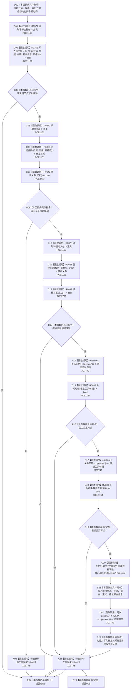

# CF-L13-0016 特征体系写入槽位会话现状流程图

图类型：现状流程图
代码版本：`3920a74638264f9f539d50f32f3c9fe5fb1982ab`
源码 blob：`a47cd9b07794d30abc6cb9d1df319056105cd596`
覆盖文件：`海中鱼巣/领域/数据操作.特征体系.ixx:1499-1523`
唯一根函数：R0361
完整签名：`static bool 海中鱼巣::特征体系数据操作::写入槽位_会话(结构写入会话& 会话, const 特征槽位写入规格& 规格, 特征槽位值式材料& 输出)`
参数：`会话` 为结构写入会话引用；`规格` 为槽位主键、宿主和定义输入；`输出` 为成功路径写入的值式材料引用
返回结果：带主键槽位节点、归属关系和模板关系全部创建并在会话内可读时写满输出并返回 true；任一步异常返回 false
已登记调用方：R0391（RCE1239）
直接项目函数：R0371（RCE1160，2 次）、R0358（RCE1159）、R0372（RCE1162，2 次）、R0023（RCE1161，2 次）、R0642（RCE2773，2 次）、R0373（RCE1163，2 次）、R0038（RCE1164，2 次）
外部边界：X03742（关系句柄 optional 解引用 4 次）、X03743（两个关系结果 optional 析构）
未解析项目调用：0
逐行映射表：`流程图/代码流程图/L13/CF-L13-0016_特征体系写入槽位会话_逐行代码映射表.md`
依据：关系发布基线、冻结源码与 RCE2773
结构读取与写入：创建槽位主信息、节点、主键绑定、归属关系和模板关系；成功后改写输出材料；事务提交由外层调用方决定
逻辑内返回：无
内部错误边界：任一创建、关系成功检查或会话内读回不成立均返回 false，由外层会话事务收口
不得作为施工许可：是
不得宣称：输出材料写满表示关系已提交、发布或事务外可读

## 流程图

## 当前边界

- 第 1509、1512 行 `.成功()` 的静态类型均为 `带值结构写入结果<关系句柄>`，唯一匹配 R0642；该直接项目边在原聚合中缺失。
- R0642 的 true 已包含 `值.has_value()`，因此后续四次 optional 解引用均受成功分支支配。
- 本函数只请求会话内写入和读回，不调用 `请求提交()`；false 分支及候选回收由外层结构写入执行器统一收口。
