# CF-L13-0017 特征体系写入初始值会话现状流程图

图类型：现状流程图
代码版本：`3920a74638264f9f539d50f32f3c9fe5fb1982ab`
源码 blob：`a47cd9b07794d30abc6cb9d1df319056105cd596`
覆盖文件：`海中鱼巣/领域/数据操作.特征体系.ixx:1525-1560`
唯一根函数：R0362
完整签名：`static bool 海中鱼巣::特征体系数据操作::写入初始值_会话(结构写入会话& 会话, 特征值原始材料事务参与者& 参与者, 节点句柄 实例槽位, const 初始特征值写入规格& 规格, 特征原始值式材料& 输出)`
参数：`会话`、`参与者` 与 `输出` 为可变借用；`实例槽位` 按值传入；`规格` 为只读借用
返回结果：全部候选写入、材料登记和可读性复核成功时填充 `输出` 并返回 `true`；任一步失败返回 `false`
调用图：`流程图/主程序可达调用关系/01_main可达项目调用边表.md`
已登记调用方：R0391（RCE1240）
直接项目函数：R0358（RCE1165）、R0375（RCE1166）、R0023（RCE1167）、R0376（RCE1168）、R0028（RCE1169）、R0377（RCE1170）、R0378（RCE1171）、R0379（RCE1172）、R0270（RCE1173）、R0038（RCE1174）、R0029（RCE1175）
直接项目调用：R0642（RCE2774，第 1536 行）、R0138（RCE2775，第 1538 行）
外部边界：X02149（第 1542 行，精确 `std::move<特征值初始原始材料&>` 模板实例）、X03744（I64 optional 解引用，第 1538、1545 行）、X03745（关系句柄 optional 解引用，第 1543、1553 行）
未解析项目调用：0
逐行映射表：`流程图/代码流程图/L13/CF-L13-0017_特征体系写入初始值会话_逐行代码映射表.md`
输入契约 / 调用语境表：本图“输入、结构与返回边界”
非成功返回二分审查表：配对逐行映射的“非成功口径”
偏差清单：本批已把 RCE2774—RCE2775、X03744—X03745 与 X02149 精确签名闭合到当前聚合关系
依据提交 / 结构化消息：调用关系基线 `caab8644416dea13ea598b714289d1c86ac05304`；冻结源码提交 `3920a74638264f9f539d50f32f3c9fe5fb1982ab`
验证输出：本批 Mermaid、节点双向、源码覆盖与差异格式检查
结构读取与写入：在既有结构写入会话内创建特征值节点、归属关系和可选 I64 候选，登记初始原始材料；成功后只填充调用方提供的值式输出
不得作为施工许可：是
不得宣称：返回 `true` 表示会话候选已经提交或发布

## 流程图

```mermaid
flowchart TD
    N01["N01【本函数内具体指令】进入R0362并初始化新主信息与新值句柄"]
    C02["C02【函数调用】R0358以规格幂等主键写入特征值候选<br/>RCE1165、RCE1166"]
    D03{"D03【本函数内具体指令】带主键节点写入是否成功"}
    C04["C04【函数调用】R0023创建实例槽位到新值的归属关系<br/>RCE1167"]
    C05["C05【函数调用】R0642检查带值关系结果成功<br/>RCE2774"]
    D06{"D06【本函数内具体指令】关系创建是否成功"}
    C07["C07【函数调用】R0376读取原始类型<br/>RCE1168"]
    D08{"D08【本函数内具体指令】原始类型是否为I64"}
    C09["C09【函数调用】R0377读取I64 optional并经X03744解引用，R0028写候选值，R0138检查成功<br/>RCE1169、RCE1170、RCE2775"]
    D10{"D10【本函数内具体指令】I64候选写入是否成功"}
    C11["C11【函数调用】R0376—R0379读取类型与三类载荷并构造初始原始材料<br/>RCE1168、RCE1170—RCE1172"]
    C12["C12【函数调用】经X02149移动材料并由R0270登记<br/>RCE1173"]
    D13{"D13【本函数内具体指令】初始材料登记是否成功"}
    C14["C14【函数调用】经X03745解引用关系结果值并由R0038检查关系可读<br/>RCE1174"]
    D15{"D15【本函数内具体指令】原始类型是否为I64"}
    C16["C16【函数调用】R0377读取并经X03744解引用I64值，R0029复核候选匹配<br/>RCE1170、RCE1175"]
    N17["N17【本函数内具体指令】把I64匹配结果与关系可读结果合并为完整"]
    D18{"D18【本函数内具体指令】完整是否为真"}
    C19["C19【函数调用】R0375—R0379读取规格字段用于输出<br/>RCE1166、RCE1168、RCE1170—RCE1172"]
    C20["C20【函数调用】经X03745解引用当前关系句柄用于输出关系"]
    N21["N21【本函数内具体指令】写入已找到状态、句柄、关系、类型、版本与三类载荷"]
    R22["R22【本函数内具体指令】返回true"]
    R23["R23【本函数内具体指令】返回false"]
    N01 --> C02 --> D03
    D03 -- 否 --> R23
    D03 -- 是 --> C04 --> C05 --> D06
    D06 -- 否 --> R23
    D06 -- 是 --> C07 --> D08
    D08 -- 是 --> C09 --> D10
    D10 -- 否 --> R23
    D10 -- 是 --> C11
    D08 -- 否 --> C11
    C11 --> C12 --> D13
    D13 -- 否 --> R23
    D13 -- 是 --> C14 --> D15
    D15 -- 是 --> C16 --> N17
    D15 -- 否 --> D18
    N17 --> D18
    D18 -- 否 --> R23
    D18 -- 是 --> C19 --> C20 --> N21 --> R22
```

## 输入、结构与返回边界

- 本函数只操作传入的活动写入会话和事务参与者；它不提交事务，也不把候选直接变成已发布事实。
- I64 路径额外写入并复核候选 I64 值；非 I64 路径跳过该候选表操作，但仍登记完整原始材料。
- 任一 `false` 都是本层允许的逻辑内失败传播；具体结构错误仍应由产生失败结果的被调函数范围继续追查。
