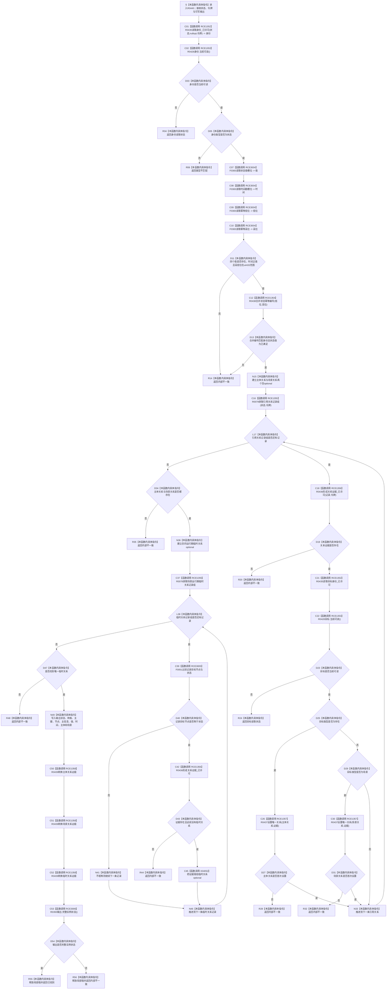

# CF-L13-0018 读取结算实例状态已许可现状流程图

图类型：现状流程图
代码版本：`3920a74638264f9f539d50f32f3c9fe5fb1982ab`
当前工作区复核基线：`fe2ca0c3e7b8f734053b87b96de65ea0f2e57b67`
源码 blob：`16ac9534baeda26ac8a712066e713f3339f6e0c8`
覆盖文件：`海中鱼巣/领域/数据操作.需求任务方法.ixx:2001-2072`
唯一根函数：R0440
完整签名：`海中鱼巣::需求任务方法读取状态 海中鱼巣::需求任务方法数据操作::读取结算实例状态_已许可(海中鱼巣::节点句柄 状态, const 海中鱼巣::结构事务令牌& 令牌, 海中鱼巣::状态值式材料& 输出) const`
参数：`状态` 按值传入；`令牌` 为调用期只读借用；`输出` 为调用方拥有的可写值式材料
返回结果：身份读取结果或 `类型不匹配` 可直接返回；结算状态内部材料、关系基数或读回投影不闭合时返回 `内部不一致`；完整实例状态返回 `已找到`
调用方：R0441（RCE1360）
直接项目函数：R0435（RCE1352）、R0428（RCE1353）、R0438（RCE1354）、R0078（RCE1355）、R0436（RCE1356）、R0437（RCE1357）、R0439（RCE1358）、F0383（RCE3004）、F0051（RCE3005）、R0393（RCE3006）
符号外部边界：X04039—X04053
调用图：`流程图/主程序可达调用关系/01_main可达项目调用边表.md`
外部边界表：`流程图/主程序可达调用关系/02_main可达外部边界表.md`
逐行映射表：`流程图/代码流程图/L13/CF-L13-0018_读取结算实例状态已许可_逐行代码映射表.md`
输入契约 / 调用语境表：本文“实例状态读取语境”
非成功返回二分审查表：本文“实例状态读取语境”
偏差清单：本文“当前边界与规范核对”
依据提交 / 结构化消息：冻结源码提交 `3920a74638264f9f539d50f32f3c9fe5fb1982ab`；当前 `main` 复核目标源码零差异
验证输出：72 行源码完整映射；10 个项目出边、15 个外部边界、0 个未解析项目调用；本切片不运行构建或程序
依据：`规范/0050_项目通用机器逻辑与禁止性规则总纲_20260721.md`、`规范/0600_代码函数流程图应用与维护规范.md`、`规范/4010_子规范_统一仓库稳定句柄与通用关系索引边界.md`、`规范/4050_子规范_入口拒绝逻辑内结果与内部逻辑错误.md`、`规范/4210_子规范_动态信息分层获取与聚合_20260720.md`、`规范/5160_子规范_需求正式结算记录与唯一结论.md`
不得作为施工许可：是
不得宣称：值槽位与关系读回发布了新状态、结算状态完整证明需求已完成当前结算、内部不一致已被修复，或本函数改变了状态、关系、主信息或索引

## 流程图

## 稳定调用合同

| 边界 | 调用点 |
| --- | --- |
| RCE1352 | 2005、2029 |
| RCE1353 | 2006、2030 |
| RCE3004 | 2009—2014 |
| RCE1354 | 2019 |
| RCE1355 | 2026、2046 |
| RCE1356 | 2027、2049 |
| RCE1357 | 2032、2036 |
| RCE3005 | 2048 |
| RCE1358 | 2066—2068 |
| RCE3006 | 2069 |
| X04039—X04041 | 四个 `optional<int64_t>` 的 `has_value`、`operator* const` 与析构 |
| X04042—X04047 | 两个 `vector<关系记录>` 范围循环的 `begin`、`end`、迭代器比较 / 解引用 / 递增与析构 |
| X04048—X04053 | `optional<高级关系证据>` 的 `has_value`、const / 非 const 解引用、`operator->`、复制赋值与析构 |

## 实例状态读取语境

| 位置 | 条件 | 二分口径 | 结构变化 |
| --- | --- | --- | --- |
| 2006—2007 | 身份不可读或类型不匹配 | 入口 / 当前性只读结果 | 无 |
| 2015—2021 | 节点已读回但值、时间、幂等材料或结论不闭合 | 内部逻辑错误，追根因解决 | 无 |
| 2028—2055 | 已进入状态关系回读，但证据、基数或临时归属不闭合 | 内部逻辑错误，追根因解决 | 无 |
| 2069—2071 | 已形成输出但完整实例状态复核失败 | 内部逻辑错误，追根因解决 | 只改变调用方输出材料 |

## 当前边界与规范核对

- 值式结算状态同时回读主信息值、发生时间、幂等身份、主体、场景和运行期临时归属，不用单个 I64 代替完整状态。
- 关系重复、缺失或回读失败均在前置已经成立后按内部不一致收口。
- 返回 `已找到` 只说明本次只读投影闭合，不发布状态，也不单独证明需求结算已经成立。
