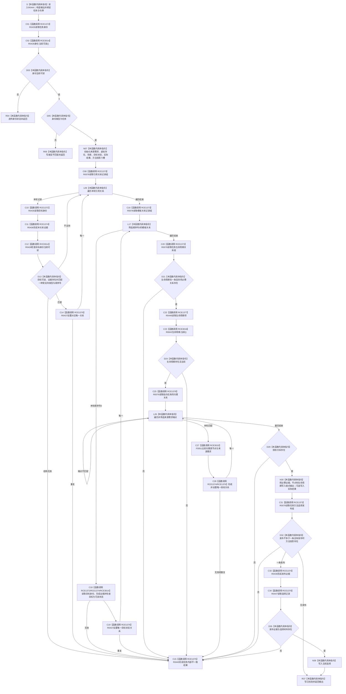

# CF-L13-0019 读取任务已许可现状流程图

图类型：现状流程图
代码版本：`3920a74638264f9f539d50f32f3c9fe5fb1982ab`
当前工作区复核基线：`af74e46ef3fd0b1b2c108d695569855909a59ee1`
源码 blob：`16ac9534baeda26ac8a712066e713f3339f6e0c8`
覆盖文件：`海中鱼巣/领域/数据操作.需求任务方法.ixx:2313-2401`
唯一根函数：R0444
完整签名：`海中鱼巣::任务权威材料 海中鱼巣::需求任务方法数据操作::读取任务_已许可(海中鱼巣::节点句柄 任务, const 海中鱼巣::结构事务令牌& 令牌) const`
参数：`任务` 按值传入；`令牌` 为调用期只读借用
返回结果：身份不可读时透传读取状态；类型错误时返回类型不匹配；必需关系、生命周期、授权或选择材料不一致时返回内部不一致；结构齐全时返回已找到的任务权威材料
调用方：已登记 R0444 直接调用方
直接项目函数：R0435（RCE1372）、R0078（RCE1373）、R0436（RCE1374）、R0445（RCE1375）、R0437（RCE1376）、R0446（RCE1377）、R0079（RCE1378）、R0447（RCE1379）、R0428（RCE3014）、F0051（RCE3015）、R0843（RCE3016）
符号外部边界：X04089—X04107
逐行映射表：`流程图/代码流程图/L13/CF-L13-0019_读取任务已许可_逐行代码映射表.md`
依据提交 / 结构化消息：冻结源码提交 `3920a74638264f9f539d50f32f3c9fe5fb1982ab`；当前 `main` 复核目标源码零差异
验证输出：89 行源码完整映射；11 个项目出边、19 个外部边界、0 个未解析项目调用；本切片不运行构建或程序
依据：`规范/0050_项目通用机器逻辑与禁止性规则总纲_20260721.md`、`规范/0600_代码函数流程图应用与维护规范.md`
不得作为施工许可：是
不得宣称：读取成功等于任务已执行或能力完成、内部不一致已经修复，或本函数写入了任务、关系、状态、主信息或索引

## 流程图

## 当前边界与规范核对

- 本函数只聚合任务当前身份、关系、生命周期、授权和可选选择材料，不创建、更新或发布这些事实。
- 进入身份检查后的结构缺失、重复或端点不一致统一走内部不一致，不得降级为普通未找到。
