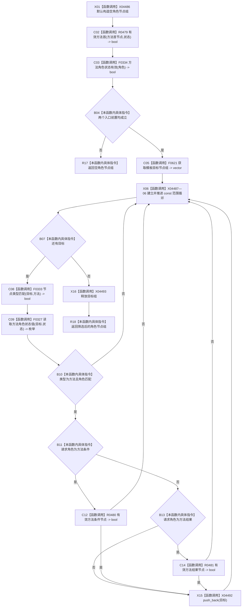

# CF-L13-0020 方法服务读取方法角色节点集合现状流程图

代码版本：`0a93526882cb33c61c2fbb04ecad1aeaddcfe225`
当前工作区复核基线：`ece29318f80cad2ce7a4abce9b009c60cd4cdfdd`
源码 blob：`839dd462c70e8d54b6f22f1126d751ac9425398a`
图类型：现状流程图
覆盖文件：`海中鱼巣/领域/方法服务.h:1687-1705`
唯一根函数：R0482
完整签名：`std::vector<节点句柄> 海中鱼巣::方法服务::读取方法角色节点集合(节点句柄 方法首节点, 方法角色状态 角色, const 状态服务& 状态) const`
参数：方法首节点与角色值传入；状态只读借用
返回结果：入口无效时返回空组；否则返回模板目标中类型、角色及角色专属结构均有效的节点组
调用图：入边 RCE1491、RCE1492；出边 RCE1470—RCE1476
逐行映射表：`流程图/代码流程图/L13/CF-L13-0020_方法服务读取方法角色节点集合_逐行代码映射表.md`
输入契约 / 调用语境表：R0490/R0491 分别以方法条件和方法结果角色调用
非成功返回二分审查表：入口无效返回空组；循环候选不符仅跳过
偏差清单：新增 vector 构造、范围循环、push_back 与局部目标组析构边界建议
依据提交 / 结构化消息：冻结源码、当前调用关系与逐调用点复核
验证输出：本批不运行构建或程序
不得作为施工许可：是
不得宣称：角色节点集合满足现行目标业务合同

## 节点合同

| 节点组 | 类型 | 输入 | 结果 / 后继 |
| --- | --- | --- | --- |
| X01—B04 | 函数调用 / 本函数内具体指令 | 方法首、角色、状态 | 无效入口返回空组 |
| C05—B10 | 函数调用 / 本函数内具体指令 | 模板目标组 | 按类型和角色做首轮筛选 |
| B11—C14 | 函数调用 / 本函数内具体指令 | 已匹配目标 | 条件 / 结果角色追加专属结构复核 |
| X15—R18 | 函数调用 / 本函数内具体指令 | 合格目标与局部容器 | 追加、释放目标组并返回 |

## 关键边界

- 方法条件和方法结果必须通过专属结构复核；其它有效角色只执行通用类型与角色复核。
- 所有无效候选都被安静跳过，返回组不携带失败原因且不写机器事实。
