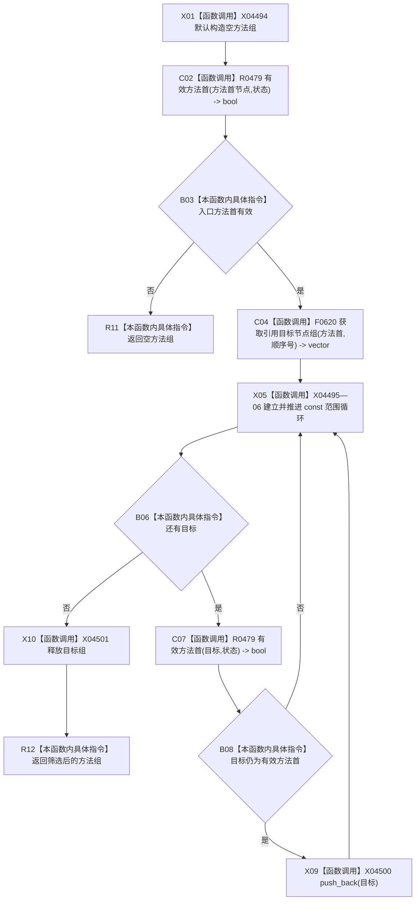

# CF-L13-0021 方法服务读取方法关系目标组现状流程图

代码版本：`0a93526882cb33c61c2fbb04ecad1aeaddcfe225`
当前工作区复核基线：`ece29318f80cad2ce7a4abce9b009c60cd4cdfdd`
源码 blob：`839dd462c70e8d54b6f22f1126d751ac9425398a`
图类型：现状流程图
覆盖文件：`海中鱼巣/领域/方法服务.h:1732-1745`
唯一根函数：R0483
完整签名：`std::vector<节点句柄> 海中鱼巣::方法服务::读取方法关系目标组(节点句柄 方法首节点, std::int64_t 顺序号, const 状态服务& 状态) const`
参数：方法首节点、顺序号值传入；状态只读借用
返回结果：入口方法首无效时返回空组；否则返回指定引用顺序号下仍为有效方法首的目标组
调用图：入边 RCE1443、RCE1444；出边 RCE1477、RCE1478
逐行映射表：`流程图/代码流程图/L13/CF-L13-0021_方法服务读取方法关系目标组_逐行代码映射表.md`
输入契约 / 调用语境表：R0471/R0472 分别传前置方法与后续方法顺序号
非成功返回二分审查表：入口无效返回空组；无效目标在循环中跳过
偏差清单：新增 vector 构造、范围循环、push_back 与目标组析构边界建议
依据提交 / 结构化消息：冻结源码、当前调用关系与逐调用点复核
验证输出：本批不运行构建或程序
不得作为施工许可：是
不得宣称：方法关系顺序号模型符合现行目标设计

## 节点合同

| 节点组 | 类型 | 输入 | 结果 / 后继 |
| --- | --- | --- | --- |
| X01—B03 | 函数调用 / 本函数内具体指令 | 方法首、状态 | 无效入口返回空组 |
| C04—B08 | 函数调用 / 本函数内具体指令 | 指定顺序号的引用目标组 | 逐项复核有效方法首 |
| X09—R12 | 函数调用 / 本函数内具体指令 | 合格目标、局部容器 | 追加、释放目标组并返回 |

## 关键边界

- 本函数不限制顺序号的业务含义，调用方决定前置或后续语境。
- 无效关系目标被安静筛除；函数只读关系和登记状态，不写机器事实。
