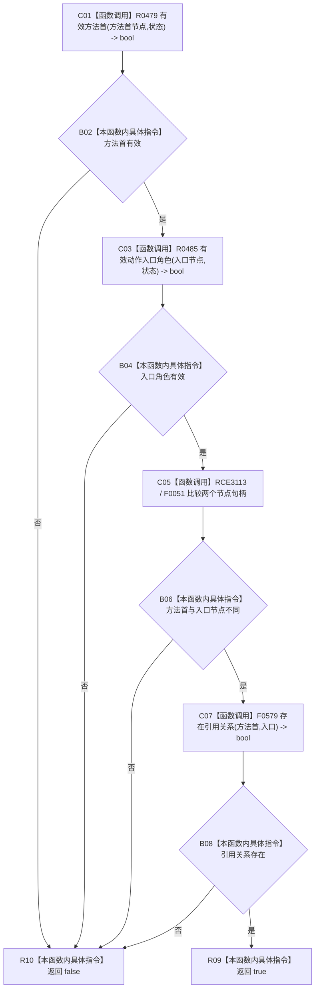

# CF-L13-0022 方法服务有效动作入口现状流程图

代码版本：`0a93526882cb33c61c2fbb04ecad1aeaddcfe225`
当前工作区复核基线：`ece29318f80cad2ce7a4abce9b009c60cd4cdfdd`
源码 blob：`839dd462c70e8d54b6f22f1126d751ac9425398a`
图类型：现状流程图
覆盖文件：`海中鱼巣/领域/方法服务.h:1811-1816`
唯一根函数：R0486
完整签名：`bool 海中鱼巣::方法服务::有效动作入口(节点句柄 方法首节点, 节点句柄 动作入口节点, const 状态服务& 状态) const`
参数：方法首节点、动作入口节点值传入；状态只读借用
返回结果：方法首有效、动作入口角色有效、两个节点不同且存在方法首到入口的引用关系时返回 true，否则 false
调用图：入边 RCE1499；出边 RCE1481—RCE1483；新增项目边建议 R0486→F0051
逐行映射表：`流程图/代码流程图/L13/CF-L13-0022_方法服务有效动作入口_逐行代码映射表.md`
输入契约 / 调用语境表：R0494 对读取到的动作入口候选调用
非成功返回二分审查表：无显式中途返回；任一结构前置失败短路 false
偏差清单：1814 行节点句柄 `operator==` 已登记项目调用边 RCE3113
依据提交 / 结构化消息：冻结源码、F0051 身份、当前调用关系与逐调用点复核
验证输出：本批不运行构建或程序
不得作为施工许可：是
不得宣称：动作入口结构符合现行目标设计

## 节点合同

| 节点组 | 类型 | 输入 | 结果 / 后继 |
| --- | --- | --- | --- |
| C01—B04 | 函数调用 / 本函数内具体指令 | 方法首、入口节点、状态 | 复核两个节点角色 |
| C05 / B06 | 函数调用 / 本函数内具体指令 | 两个节点句柄 | 相等时短路 false |
| C07—R10 | 函数调用 / 本函数内具体指令 | 方法首到入口的引用关系 | 返回 bool |

## 关键边界

- 本函数只读登记、角色、状态与关系结构，不写机器事实。
- 节点互异检查调用项目内 F0051，而非内建比较；共享图谱需要新增稳定项目边。
