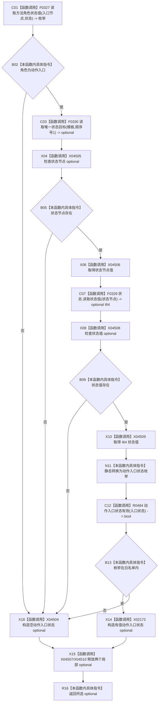

# CF-L13-0023 方法服务读取动作入口状态现状流程图

代码版本：`0a93526882cb33c61c2fbb04ecad1aeaddcfe225`
当前工作区复核基线：`ece29318f80cad2ce7a4abce9b009c60cd4cdfdd`
源码 blob：`839dd462c70e8d54b6f22f1126d751ac9425398a`
图类型：现状流程图
覆盖文件：`海中鱼巣/领域/方法服务.h:1818-1832`
唯一根函数：R0487
完整签名：`std::optional<动作入口状态> 海中鱼巣::方法服务::读取动作入口状态(节点句柄 动作入口节点, const 状态服务& 状态) const`
参数：动作入口节点值传入；状态只读借用
返回结果：角色、唯一状态目标、I64 状态值及白名单枚举均有效时返回状态 optional，否则返回 `std::nullopt`
调用图：入边 RCE1480、RCE1500；出边 RCE1484—RCE1487
逐行映射表：`流程图/代码流程图/L13/CF-L13-0023_方法服务读取动作入口状态_逐行代码映射表.md`
输入契约 / 调用语境表：R0485/R0494 对动作入口候选读取状态
非成功返回二分审查表：角色、状态目标、状态值或枚举无效均折叠为空 optional
偏差清单：X02172 需精确替换为值构造签名；新增 nullopt、optional 访问与生命周期边界建议
依据提交 / 结构化消息：冻结源码、当前调用关系与逐调用点静态类型复核
验证输出：本批不运行构建或程序
不得作为施工许可：是
不得宣称：动作入口状态读取满足现行目标状态机或能力完成

## 节点合同

| 节点组 | 类型 | 输入 | 结果 / 后继 |
| --- | --- | --- | --- |
| C01—B05 | 函数调用 / 本函数内具体指令 | 入口节点、状态 | 复核角色并读取唯一状态目标 |
| X06—B09 | 函数调用 / 本函数内具体指令 | 状态节点 | 读取 I64 状态值 optional |
| X10—B13 | 函数调用 / 本函数内具体指令 | I64 状态值 | 转换枚举并调用白名单谓词 |
| X14—R16 / X18 | 函数调用 / 本函数内具体指令 | 有效枚举或失败分支 | 构造返回 optional，释放局部量 |

## 关键边界

- `static_cast` 可生成未定义枚举值，R0484 白名单复核决定最终是否返回有值。
- 四类失败都返回空 optional，不写结构且不区分失败原因。
