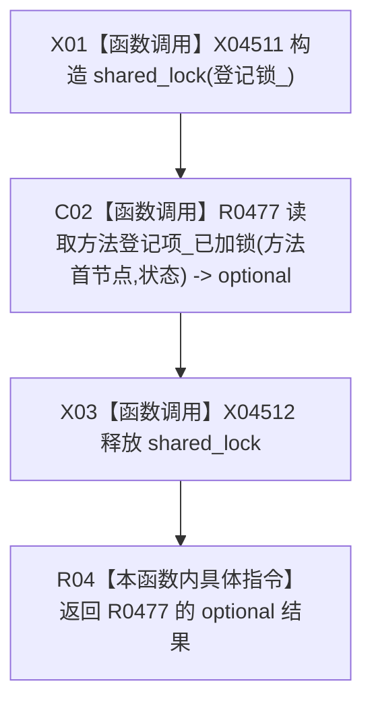

# CF-L13-0024 方法服务读取方法登记项现状流程图

代码版本：`0a93526882cb33c61c2fbb04ecad1aeaddcfe225`
当前工作区复核基线：`ece29318f80cad2ce7a4abce9b009c60cd4cdfdd`
源码 blob：`839dd462c70e8d54b6f22f1126d751ac9425398a`
图类型：现状流程图
覆盖文件：`海中鱼巣/领域/方法服务.h:452-456`
唯一根函数：R0488
完整签名：`std::optional<方法登记项材料> 海中鱼巣::方法服务::读取方法登记项(节点句柄 方法首节点, const 状态服务& 状态) const`
参数：方法首节点值传入；状态只读借用
返回结果：持有登记共享锁期间调用已加锁读取并原样返回其 optional 结果
调用图：入边 RCE1461；出边 RCE1488
逐行映射表：`流程图/代码流程图/L13/CF-L13-0024_方法服务读取方法登记项_逐行代码映射表.md`
输入契约 / 调用语境表：R0479 及其它登记读取路径通过公开只读入口调用
非成功返回二分审查表：无本函数判断；R0477 的空 optional 原样传回
偏差清单：新增 shared_lock 构造和析构边界建议
依据提交 / 结构化消息：冻结源码、当前调用关系与逐调用点复核
验证输出：本批不运行构建或程序
不得作为施工许可：是
不得宣称：取得共享锁证明全部登记读写并发合同正确

## 节点合同

| 节点 | 类型 | 输入 | 结果 / 后继 |
| --- | --- | --- | --- |
| X01 | 函数调用 | 登记锁_ | 持有共享锁 |
| C02 | 函数调用 | 方法首节点、状态 | 方法登记项 optional |
| X03 / R04 | 函数调用 / 本函数内具体指令 | 共享锁、optional | 解锁并返回 |

## 关键边界

- 本函数只建立登记读锁，不验证调用者是否还持有其它锁。
- 空 optional 的具体原因由 R0477 内部折叠，本函数不追加诊断或结构写入。
