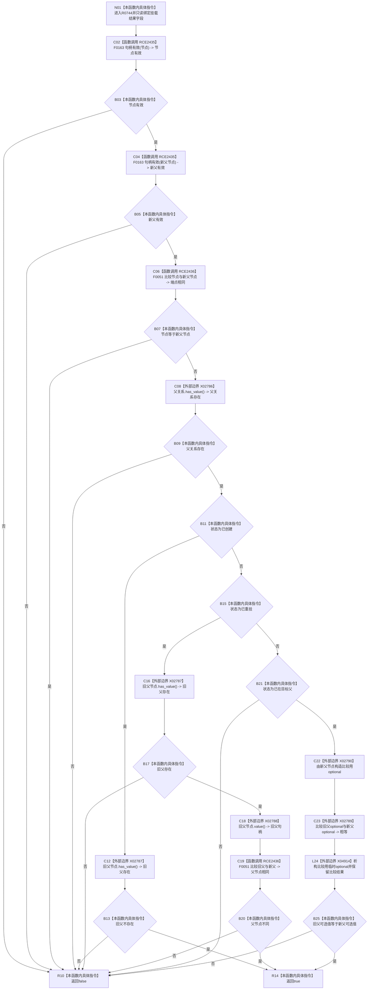

# CF-L13-0025 节点挂载结果关系已确定现状流程图

图类型：现状流程图
代码版本：`03a8b7ac099ccea83e57f2696e2290b7bcdfacaf`
当前工作区复核基线：`8632fb891fb3beea255aff1946c07b0fe975ef2b`
源码 blob：`0628ee4ade067238e826b26753d806c05b507764`
覆盖文件：`海中鱼巣/核心/关系仓库.h:155-167`
唯一根函数：R0744
完整签名：`bool 海中鱼巣::节点挂载结果::关系已确定() const`
参数：无显式参数；只读节点、新父节点、旧父节点、父关系与挂载状态
返回结果：端点与父关系有效，且当前状态对应的旧父条件成立时返回 `true`；否则返回 `false`
调用图：`流程图/主程序可达调用关系/00_main可达函数身份表.md`、`01_main可达项目调用边表.md`、`02_main可达外部边界表.md`
已登记调用方：R0743
直接项目函数：F0163（RCE2435，两次）、F0051（RCE2436，两次）
外部边界：X02786—X02790、X04914
逐行映射表：`流程图/代码流程图/L13/CF-L13-0025_节点挂载结果关系已确定_逐行代码映射表.md`
输入契约 / 调用语境表：本图内嵌审查；调用方查询关系仓库已经形成的节点挂载结果
非成功返回二分审查表：本图内嵌审查；`false` 表示结果字段不满足对应状态的一致性条件
偏差清单：无独立文件；本批只记录当前代码事实
依据提交 / 结构化消息：冻结源码提交 `03a8b7ac099ccea83e57f2696e2290b7bcdfacaf`、正式图谱与顶层稳定边裁决
验证输出：Mermaid / 节点集合 / 逐行覆盖 PASS；目标 no-index 与全仓 diff 检查 PASS；strict 108/108 PASS；未构建、未运行
不得作为施工许可：是
不得宣称：关系确定分类已证明仓库终态、能力载荷或业务闭环完成验收

## 流程图

## 当前边界

- `已创建`、`已重挂` 与 `已在目标父` 三种状态使用不同旧父节点条件；其它状态返回 `false`。
- X04914 只承载第 166 行比较用临时 `optional<节点句柄>` 的生命周期结束，不形成项目函数身份。
