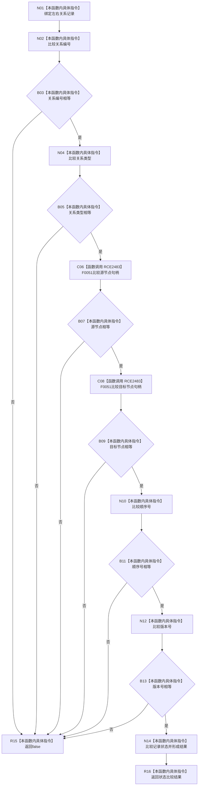

# CF-L13-0026 结构写入会话关系记录一致现状流程图

图类型：现状流程图
代码版本：`03a8b7ac099ccea83e57f2696e2290b7bcdfacaf`
当前工作区复核基线：`ef4f7bda76c92c0eb11456cfa267d76f35810616`
源码 blob：`df70de9c299c74f7f0766a3e94facaf504f57968`
覆盖文件：`海中鱼巣/核心/会话.结构写入.ixx:788-796`
唯一根函数：R0748
完整签名：`bool 海中鱼巣::结构写入会话::关系记录一致(const 海中鱼巣::关系记录& 左, const 海中鱼巣::关系记录& 右)`
参数：`左`、`右` 均为只读非拥有借用，调用期间必须保持有效
返回结果：七个字段按短路顺序全部相等时返回 `true`，任一字段不等时返回 `false`
调用图：`流程图/主程序可达调用关系/01_main可达项目调用边表.md`
逐行映射表：`流程图/代码流程图/L13/CF-L13-0026_结构写入会话关系记录一致_逐行代码映射表.md`
输入契约 / 调用语境表：R0053 在关系变更写集读回时比较能力写后记录与当前记录
非成功返回二分审查表：`false` 是记录字段不一致的逻辑内比较结果，不改变结构
偏差清单：无 / 不适用；本图只登记当前实现事实
依据提交 / 结构化消息：源码冻结 `03a8b7ac099ccea83e57f2696e2290b7bcdfacaf`；无结构化执行消息
验证输出：配对逐行映射、节点集合、源码 blob 与本批机械审计
已登记调用方：R0053（RCE2482）
直接项目函数：F0051（RCE2483；源节点和目标节点各调用1次）
外部边界：无
结构读写：只读两份关系记录，不修改关系、会话写集或仓库结构
不得作为施工许可：是
不得宣称：字段相等已经证明关系业务语义正确，或比较结果会自动写入读回状态

## 流程图

## 当前边界

- 七字段顺序为关系编号、类型、源节点、目标节点、顺序号、版本号、状态；前项不等时后项不再求值。
- RCE2483 复用同一稳定边，分别覆盖第791行和第792行的两个节点句柄相等调用。
