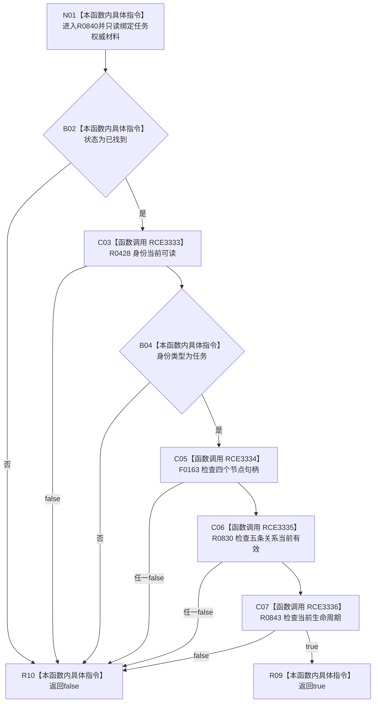

# CF-L13-0027 任务权威材料完整承接现状流程图

图类型：现状流程图
代码版本：`03a8b7ac099ccea83e57f2696e2290b7bcdfacaf`
当前工作区复核基线：`4e0ac10ae3b18404ff2b623faa0fb006fa0fc7a1`
源码 blob：`16ac9534baeda26ac8a712066e713f3339f6e0c8`
覆盖文件：`海中鱼巣/领域/数据操作.需求任务方法.ixx:271-278`
唯一根函数：R0840
完整签名：`bool 海中鱼巣::任务权威材料::完整承接() const noexcept`
参数：无显式参数；只读任务权威材料
返回结果：读取状态、身份、四个节点、五条关系和当前生命周期全部满足时返回 true，否则 false
调用图：`流程图/主程序可达调用关系/00_main可达函数身份表.md`、`01_main可达项目调用边表.md`、`02_main可达外部边界表.md`
已登记调用方：R0441
直接项目函数：R0428（RCE3333）、F0163（RCE3334，四次）、R0830（RCE3335，五次）、R0843（RCE3336）
外部边界：无
逐行映射表：`流程图/代码流程图/L13/CF-L13-0027_任务权威材料完整承接_逐行代码映射表.md`
不得作为施工许可：是
不得宣称：完整承接证明任务已经执行、结算或发布

## 流程图

## 当前边界

- 本函数只组合值式材料，不访问仓库；RCE3333—RCE3336 为本批补齐的真实直接边。
