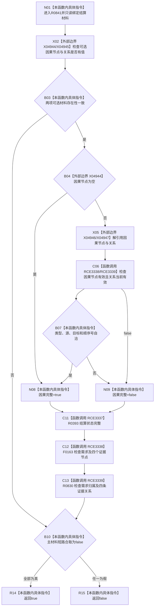

# CF-L13-0028 需求正式结算材料完整现状流程图

图类型：现状流程图
代码版本：`03a8b7ac099ccea83e57f2696e2290b7bcdfacaf`
当前工作区复核基线：`4e0ac10ae3b18404ff2b623faa0fb006fa0fc7a1`
源码 blob：`16ac9534baeda26ac8a712066e713f3339f6e0c8`
覆盖文件：`海中鱼巣/领域/数据操作.需求任务方法.ixx:131-163`
唯一根函数：R0841
完整签名：`bool 海中鱼巣::需求正式结算材料::完整() const noexcept`
参数：无显式参数；只读正式结算材料
返回结果：结算状态、需求与四类证据关系完整，且可选因果节点与关系成对并自洽时返回 true，否则 false
调用图：`流程图/主程序可达调用关系/00_main可达函数身份表.md`、`01_main可达项目调用边表.md`、`02_main可达外部边界表.md`
已登记调用方：R0441
直接项目函数：R0393（RCE3337）、F0163（RCE3338）、R0830（RCE3339）
外部边界：X04944—X04947
逐行映射表：`流程图/代码流程图/L13/CF-L13-0028_需求正式结算材料完整_逐行代码映射表.md`
不得作为施工许可：是
不得宣称：材料完整证明结算事务已提交、需求已满足或证据已独立读回

## 流程图

## 当前边界

- 可选因果节点与关系必须成对出现；空对被当前代码视为允许的完整形态。
- RCE3337—RCE3339 与 X04944—X04947 为本批按冻结源码补齐。
