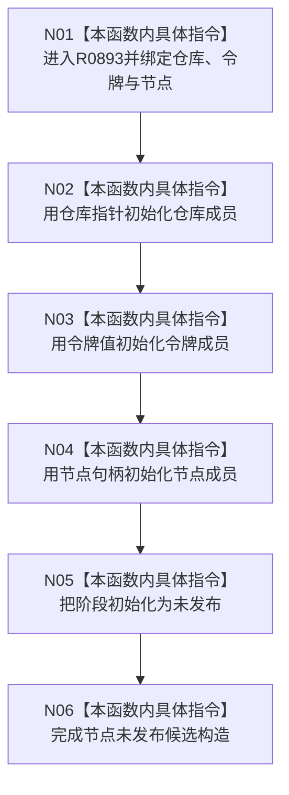

# CF-L13-0029 节点未发布候选私有构造现状流程图

图类型：现状流程图
代码版本：`03a8b7ac099ccea83e57f2696e2290b7bcdfacaf`
当前工作区复核基线：`00d917a5cf09998d2ab14d9239e1c194b5593ff0`
源码 blob：`9f8ef9a14937b13af5f31f9c8fc3457dd0078ead`
覆盖文件：`海中鱼巣/核心/节点仓库.h:48-53`
唯一根函数：R0893
完整签名：`海中鱼巣::节点未发布候选::节点未发布候选(const 海中鱼巣::节点仓库* 仓库, 海中鱼巣::结构事务令牌 令牌, 海中鱼巣::节点句柄 节点)`
参数：`仓库` 为非拥有只读指针；`令牌`、`节点` 按值输入
返回结果：构造函数无独立返回值；用三个输入初始化成员并把阶段固定为未发布
调用图：正式 main 可达关系表
已登记调用方：R0746（RCE3329）
直接项目函数：无
外部边界：无
逐行映射表：`流程图/代码流程图/L13/CF-L13-0029_节点未发布候选私有构造_逐行代码映射表.md`
不得作为施工许可：是
不得宣称：构造完成证明仓库、令牌或节点当前有效，或候选已经确认

## 流程图

## 当前边界

- 本私有构造函数只由节点仓库友元路径调用，不自行验证三个输入或发布节点。
