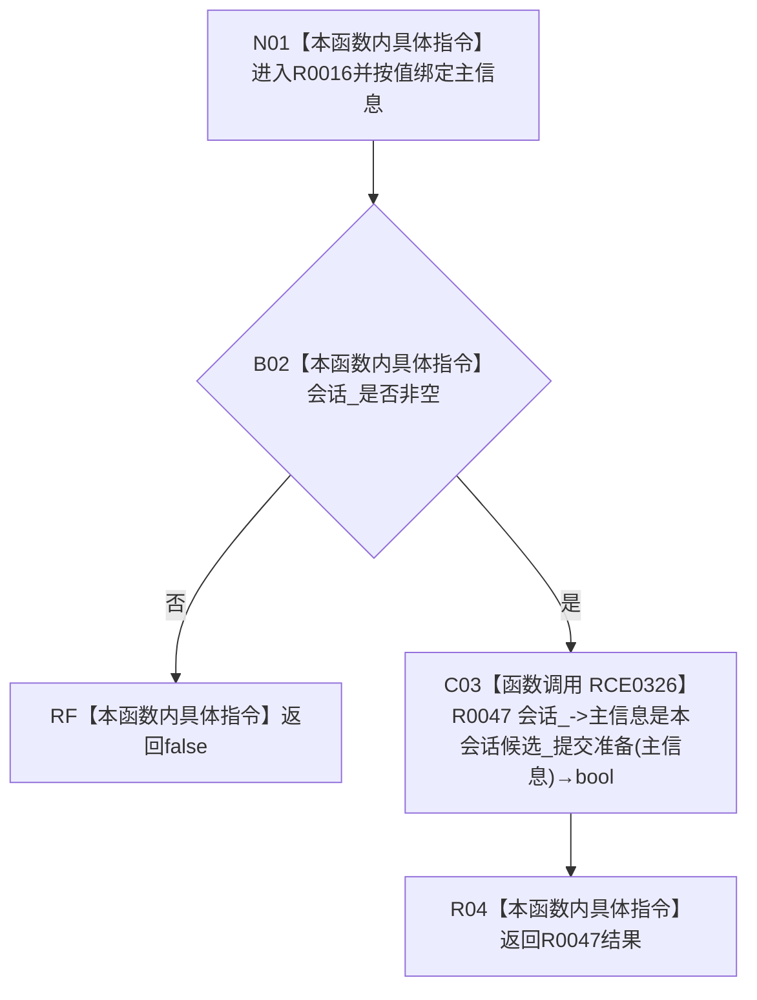

# CF-L14-0001 结构提交准备视图判断主信息候选现状流程图

图类型：现状流程图
代码版本：`0502bcbc13202f97d0d4b4ddefd8476d6deb6c1a`
源码事实提交：`3920a74638264f9f539d50f32f3c9fe5fb1982ab`
源码 blob：`df70de9c299c74f7f0766a3e94facaf504f57968`
覆盖文件：`海中鱼巣/核心/会话.结构写入.ixx:1032-1034`
唯一根函数：R0016
完整签名：`inline bool 海中鱼巣::结构提交准备只读视图::主信息是本会话候选(海中鱼巣::主信息句柄 主信息) const`
参数：主信息按值传入；隐式 `this` 为 const 非拥有借用，内部 `会话_` 为可空非拥有指针
返回结果：未绑定会话时返回 false；已绑定时返回 R0047 的候选判断结果
已登记调用方：R0260 经 RCE0867
直接项目函数：RCE0326→R0047
外部边界：无
未解析项目调用：0
逐行映射表：`流程图/代码流程图/L14/CF-L14-0001_结构提交准备视图判断主信息候选_逐行代码映射表.md`
结构读取与写入：只读会话候选材料，零结构变化
逻辑内返回：未绑定会话时短路返回 false
异常：未捕获；R0047 当前签名未声明 noexcept
验证输出：1032—1034 行完整映射；1 条项目入边、1 条项目出边
不得作为施工许可：是
不得宣称：返回 true 证明候选已发布、已提交或可被任意会话读取

## 流程图

## 当前边界

- RCE0326 实参为 `this=会话_`、`主信息=主信息`，返回 bool 直接绑定根函数返回值；仅在 `会话_ != nullptr` 时可达。
