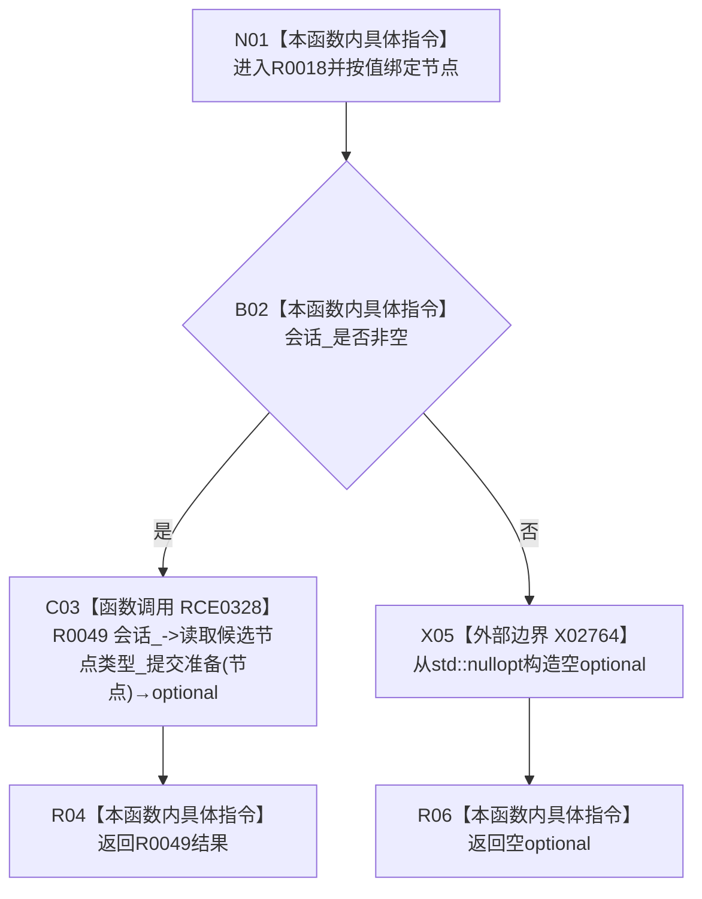

# CF-L14-0003 结构提交准备视图读取候选节点类型现状流程图

图类型：现状流程图
代码版本：`0502bcbc13202f97d0d4b4ddefd8476d6deb6c1a`
源码事实提交：`3920a74638264f9f539d50f32f3c9fe5fb1982ab`
源码 blob：`df70de9c299c74f7f0766a3e94facaf504f57968`
覆盖文件：`海中鱼巣/核心/会话.结构写入.ixx:1040-1042`
唯一根函数：R0018
完整签名：`inline std::optional<海中鱼巣::节点类型> 海中鱼巣::结构提交准备只读视图::读取候选节点类型(海中鱼巣::节点句柄 节点) const`
参数：节点按值传入；隐式 `this` 为 const 非拥有借用，内部 `会话_` 为可空非拥有指针
返回结果：未绑定会话时返回空 optional；已绑定时返回 R0049 的读取结果
已登记调用方：R0260 经 RCE0868
直接项目函数：RCE0328→R0049
外部边界：X02764 `std::optional<节点类型>::optional(std::nullopt_t)`
未解析项目调用：0
逐行映射表：`流程图/代码流程图/L14/CF-L14-0003_结构提交准备视图读取候选节点类型_逐行代码映射表.md`
结构读取与写入：只读候选节点类型材料，零结构变化
逻辑内返回：未绑定会话时返回空 optional
验证输出：1040—1042 行完整映射；1 条项目入边、1 条项目出边、1 个外部边界
不得作为施工许可：是
不得宣称：空 optional 能区分未绑定会话、无候选或候选类型不可读的具体原因

## 流程图

## 当前边界

- RCE0328 实参为 `this=会话_`、`节点=节点`，返回 optional 直接绑定根函数返回值；仅在 `会话_ != nullptr` 时可达。
- X02764 实参为 `std::nullopt`，返回空 `std::optional<节点类型>` 并直接绑定根函数返回值；仅在 `会话_ == nullptr` 时可达。
