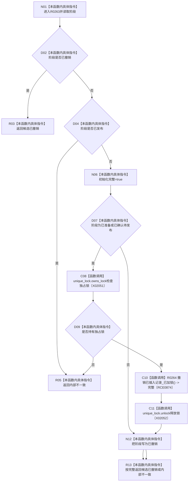

# CF-L14-0006 完成原始材料撤销现状流程图

图类型：现状流程图
代码版本：`3920a74638264f9f539d50f32f3c9fe5fb1982ab`
源码 blob：`d82fa092a2c1156d2f8de758d5e32415cb64931d`
覆盖文件：`海中鱼巣/领域/参与者.特征值原始材料.ixx:191-202`
唯一根函数：R0263
完整签名：`海中鱼巣::结构写入结果 海中鱼巣::特征值原始材料事务参与者::完成撤销() override`
参数：无显式参数；读取参与者阶段、独占锁和已插入记录跟踪
返回结果：重复撤销返回候选已撤销；已发布或锁缺失返回内部不一致；其余路径转为已撤销并按回前态完整性返回
已登记调用方：R0111（RCE0548）
直接项目函数：R0264（RCE0874）
外部边界：X02051、X02052；未解析项目调用：0
调用图：`流程图/主程序可达调用关系/01_main可达项目调用边表.md`
逐行映射表：`流程图/代码流程图/L14/CF-L14-0006_完成原始材料撤销_逐行代码映射表.md`
偏差清单：无
依据：RCE0548、RCE0874、X02051、X02052 与冻结源码
结构读取与写入：已准备或已确认路径删除本参与者插入的记录，释放锁并把阶段写为已撤销
逻辑内返回：重复撤销返回候选已撤销
不得作为施工许可：是
不得宣称：已发布记录可被撤销

## 流程图

## 当前边界

- 未准备阶段不调用删除辅助函数，直接转为已撤销。
