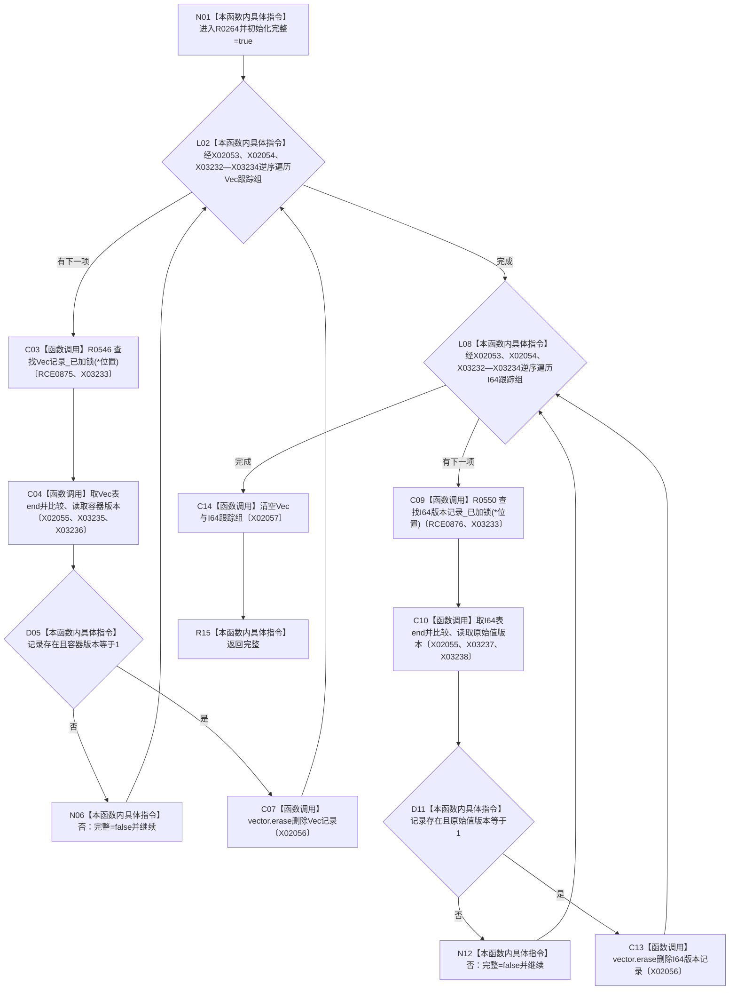

# CF-L14-0007 撤销已插入原始材料记录已加锁现状流程图

图类型：现状流程图
代码版本：`3920a74638264f9f539d50f32f3c9fe5fb1982ab`
源码 blob：`d82fa092a2c1156d2f8de758d5e32415cb64931d`
覆盖文件：`海中鱼巣/领域/参与者.特征值原始材料.ixx:204-225`
唯一根函数：R0264
完整签名：`bool 海中鱼巣::特征值原始材料事务参与者::撤销已插入记录_已加锁()`
参数：无显式参数；调用方必须已经持有特征值原始值侧表独占锁
返回结果：全部跟踪记录均存在且版本为 1 并成功删除时返回 `true`；存在缺失或版本不符时跳过该项并返回 `false`
已登记调用方：R0260（RCE0873）、R0263（RCE0874）
直接项目函数：R0546（RCE0875）、R0550（RCE0876）
外部边界：X02053—X02057、X03232—X03238；未解析项目调用：0
调用图：`流程图/主程序可达调用关系/01_main可达项目调用边表.md`
逐行映射表：`流程图/代码流程图/L14/CF-L14-0007_撤销已插入原始材料记录已加锁_逐行代码映射表.md`
偏差清单：无
依据：RCE0873—RCE0876、X02053—X02057、X03232—X03238 与冻结源码
结构读取与写入：按跟踪组逆序删除服务 Vec/I64 记录，最后清空两组跟踪节点
逻辑内返回：无；缺记录或版本不符使完整性降为 `false`
不得作为施工许可：是
不得宣称：未被本参与者跟踪的记录会被删除

## 流程图

## 当前边界

- 删除顺序与插入顺序相反；不一致项保留在服务表中，但跟踪组仍在函数末尾清空。
