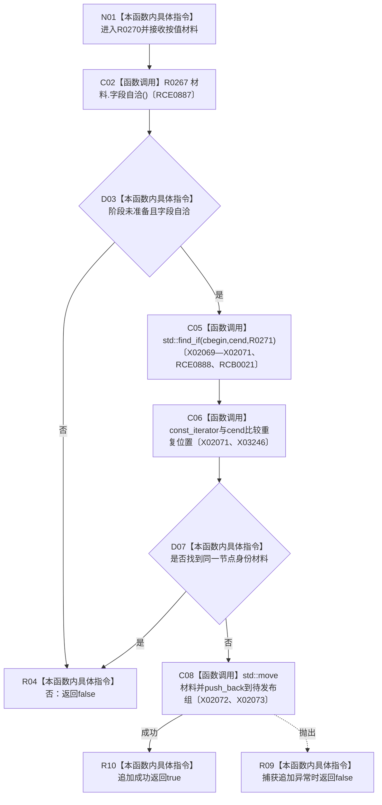

# CF-L14-0008 登记特征值初始材料现状流程图

图类型：现状流程图
代码版本：`3920a74638264f9f539d50f32f3c9fe5fb1982ab`
源码 blob：`d82fa092a2c1156d2f8de758d5e32415cb64931d`
覆盖文件：`海中鱼巣/领域/参与者.特征值原始材料.ixx:82-94`
唯一根函数：R0270
完整签名：`bool 海中鱼巣::特征值原始材料事务参与者::登记初始材料(海中鱼巣::特征值初始原始材料 材料)`
参数：初始原始材料按值传入；成功登记时移动到参与者待发布材料组
返回结果：阶段、字段、重复身份或容器追加失败时返回 `false`；唯一材料成功追加时返回 `true`
已登记调用方：R0362（RCE1173）
直接项目函数：R0267（RCE0887）、R0271（RCE0888；RCB0021）
外部边界：X02069—X02073、X03246；X02074 已停用；未解析项目调用：0
调用图：`流程图/主程序可达调用关系/01_main可达项目调用边表.md`
逐行映射表：`流程图/代码流程图/L14/CF-L14-0008_登记特征值初始材料_逐行代码映射表.md`
偏差清单：无
依据：RCE0887、RCE0888、RCE1173、RCB0021、X02069—X02073、X03246、X02074 停用裁决与冻结源码
结构读取与写入：成功时把材料移动追加到参与者待发布材料组；失败不登记
逻辑内返回：阶段、字段或重复身份拒绝，以及容器异常时返回 `false`
不得作为施工许可：是
不得宣称：登记材料已写入服务侧表或已发布

## 流程图

## 当前边界

- R0271 只比较稳定节点身份；X02074 已停用，算法调用由 R0270 的 X02069 记录。
