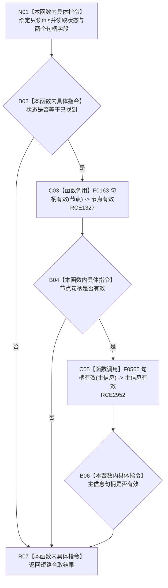

# CF-L14-0009 高级节点身份当前可读现状流程图

图类型：现状流程图
代码版本：`3920a74638264f9f539d50f32f3c9fe5fb1982ab`
源码 blob：`16ac9534baeda26ac8a712066e713f3339f6e0c8`
覆盖文件：`海中鱼巣/领域/数据操作.需求任务方法.ixx:110-113`
唯一根函数：R0428
完整签名：`bool 海中鱼巣::高级节点身份::当前可读() const noexcept`
参数：无显式参数；隐式 `this` 为只读借用
返回结果：读取状态为已找到且节点句柄、主信息句柄均有效时返回 true，否则返回 false
已登记调用方：R0434、R0440、R0447、R0456（RCE2960、RCE1353、RCE1383、RCE2965）
直接项目函数：F0163（校正后的 RCE1327）、F0565（RCE2952）
外部边界：无
逐行映射表：`流程图/代码流程图/L14/CF-L14-0009_高级节点身份当前可读_逐行代码映射表.md`
结构读取与写入：只读身份材料字段；不回读节点、主信息或索引仓库
逻辑内返回：候选身份未找到或句柄不完整时返回 false
内部错误边界：正式上游已保证当前可读后仍返回 false 时追查身份材料来源
依据提交 / 结构化消息：当前维护基线 `7951b1bea78c7338643ab18428180d521e4d5a62`；冻结源码提交 `3920a74638264f9f539d50f32f3c9fe5fb1982ab`
不得作为施工许可：是
不得宣称：返回 true 表示节点和主信息仍在仓库当前有效

## 流程图

## 当前边界

- 原 RCE1327 把第 112 行两个调用合并误绑到关系句柄重载 F0168；本批沿用 RCE1327 校正节点调用为 F0163，并以 RCE2952 单独登记主信息句柄重载 F0565。
- R0434 与 R0456 的直接调用使 R0428 的真实最短深度从 L14 校正为 L10；既有文件前缀按正式分配保持 CF-L14-0009。
