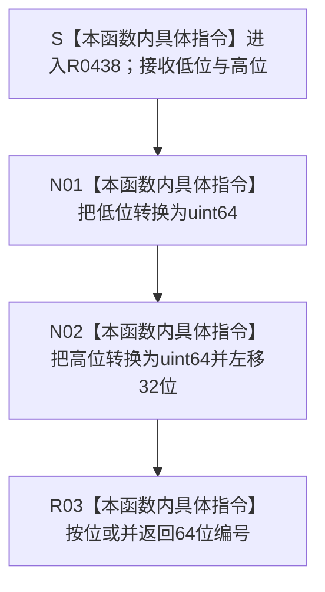

# CF-L14-0010 合并状态幂等编号现状流程图

图类型：现状流程图
代码版本：`3920a74638264f9f539d50f32f3c9fe5fb1982ab`
当前工作区复核基线：`fe2ca0c3e7b8f734053b87b96de65ea0f2e57b67`
源码 blob：`16ac9534baeda26ac8a712066e713f3339f6e0c8`
覆盖文件：`海中鱼巣/领域/数据操作.需求任务方法.ixx:1990-1995`
唯一根函数：R0438
完整签名：`static std::uint64_t 海中鱼巣::需求任务方法数据操作::合并状态幂等编号(std::int64_t 低位, std::int64_t 高位) noexcept`
参数：`低位`、`高位` 按值传入
返回结果：把低位转换为 uint64，把高位转换后左移 32 位，再按位或形成 64 位编号
调用方：R0440（RCE1354）
直接项目函数：无
符号外部边界：无
逐行映射表：`流程图/代码流程图/L14/CF-L14-0010_合并状态幂等编号_逐行代码映射表.md`
依据提交 / 结构化消息：冻结源码提交 `3920a74638264f9f539d50f32f3c9fe5fb1982ab`；当前 `main` 复核目标源码零差异
验证输出：6 行源码完整映射；0 个项目出边、0 个外部边界、0 个未解析项目调用；本切片不运行构建或程序
依据：`规范/0050_项目通用机器逻辑与禁止性规则总纲_20260721.md`、`规范/0600_代码函数流程图应用与维护规范.md`、`规范/5160_子规范_需求正式结算记录与唯一结论.md`
不得作为施工许可：是
不得宣称：本函数验证了高低位值域、生成了新幂等身份，或 64 位计算结果本身成为正式结算事实

## 流程图

## 当前边界与规范核对

- 本函数不检查输入是否非负或是否小于等于 32 位上限；该前置由 R0440 在调用前完成。
- 结果只是当前结算状态读取中的幂等主键复核材料，不独立成为机器事实。
