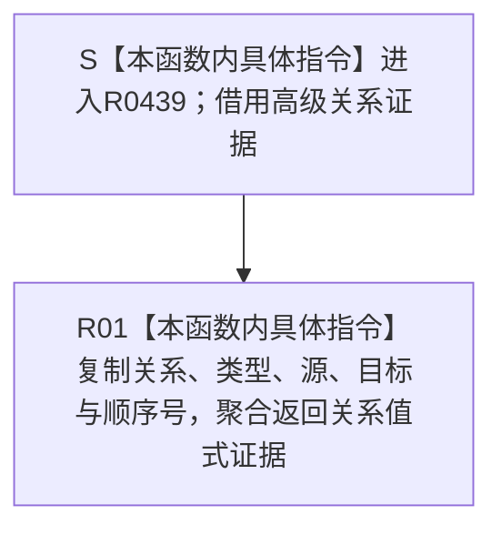

# CF-L14-0011 转换状态关系证据现状流程图

图类型：现状流程图
代码版本：`3920a74638264f9f539d50f32f3c9fe5fb1982ab`
当前工作区复核基线：`fe2ca0c3e7b8f734053b87b96de65ea0f2e57b67`
源码 blob：`16ac9534baeda26ac8a712066e713f3339f6e0c8`
覆盖文件：`海中鱼巣/领域/数据操作.需求任务方法.ixx:1997-1999`
唯一根函数：R0439
完整签名：`static 海中鱼巣::关系值式证据 海中鱼巣::需求任务方法数据操作::转换状态关系证据(const 海中鱼巣::高级关系证据& 证据) noexcept`
参数：`证据` 为调用期只读借用
返回结果：复制关系句柄、类型、源节点、目标节点和顺序号，返回 `关系值式证据`
调用方：R0440（RCE1358）
直接项目函数：无
符号外部边界：无
逐行映射表：`流程图/代码流程图/L14/CF-L14-0011_转换状态关系证据_逐行代码映射表.md`
依据提交 / 结构化消息：冻结源码提交 `3920a74638264f9f539d50f32f3c9fe5fb1982ab`；当前 `main` 复核目标源码零差异
验证输出：3 行源码完整映射；0 个项目出边、0 个外部边界、0 个未解析项目调用；本切片不运行构建或程序
依据：`规范/0050_项目通用机器逻辑与禁止性规则总纲_20260721.md`、`规范/0600_代码函数流程图应用与维护规范.md`、`规范/4210_子规范_动态信息分层获取与聚合_20260720.md`、`规范/4010_子规范_统一仓库稳定句柄与通用关系索引边界.md`
不得作为施工许可：是
不得宣称：转换过程验证了证据完整性、发布了关系，或省略记录状态后仍可独立裁决当前性

## 流程图

## 当前边界与规范核对

- 本函数只做字段投影，不再次验证 `当前有效()`；调用方 R0440 只传入已经由 R0436 回读闭合的证据。
- 返回类型不携带记录状态，不能脱离其来源调用语境独立裁决关系当前性。
