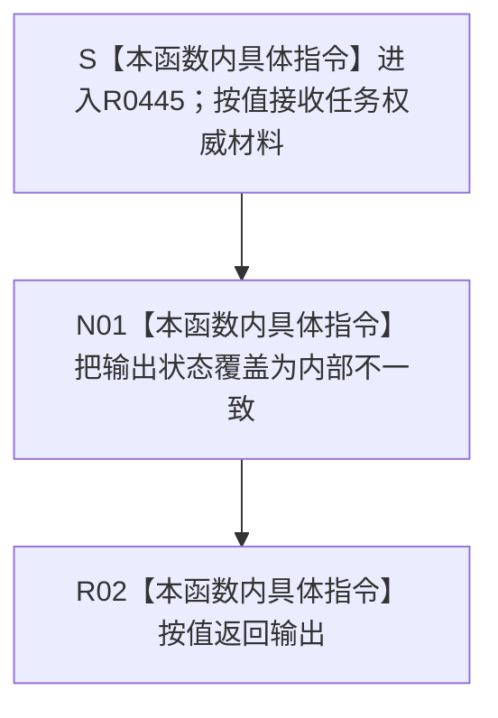

# CF-L14-0012 任务内部不一致现状流程图

图类型：现状流程图
代码版本：`3920a74638264f9f539d50f32f3c9fe5fb1982ab`
当前工作区复核基线：`57866ac5ca63235ed12da60f635d29f1aacd718b`
源码 blob：`16ac9534baeda26ac8a712066e713f3339f6e0c8`
覆盖文件：`海中鱼巣/领域/数据操作.需求任务方法.ixx:2403-2406`
唯一根函数：R0445
完整签名：`static 海中鱼巣::任务权威材料 海中鱼巣::需求任务方法数据操作::任务内部不一致(海中鱼巣::任务权威材料 输出) noexcept`
参数：`输出` 按值传入并在本函数内修改
返回结果：把读取状态覆盖为 `需求任务方法读取状态::内部不一致` 后按值返回
调用方：R0444（RCE1375）
直接项目函数：无
符号外部边界：无
逐行映射表：`流程图/代码流程图/L14/CF-L14-0012_任务内部不一致_逐行代码映射表.md`
依据提交 / 结构化消息：冻结源码提交 `3920a74638264f9f539d50f32f3c9fe5fb1982ab`；当前 `main` 复核目标源码零差异
验证输出：4 行源码完整映射；0 个项目出边、0 个外部边界、0 个未解析项目调用；本切片不运行构建或程序
依据：`规范/0050_项目通用机器逻辑与禁止性规则总纲_20260721.md`、`规范/0600_代码函数流程图应用与维护规范.md`、`规范/4050_子规范_入口拒绝逻辑内结果与内部逻辑错误.md`
不得作为施工许可：是
不得宣称：内部不一致已经修复、输出已经发布为机器事实，或本函数写入了任务、关系、状态或索引

## 流程图

## 当前边界与规范核对

- 本函数只形成统一结构化读取结果，不修复造成不一致的内部结构。
- 输入输出均为值式材料；状态赋值不是任务事实发布。
