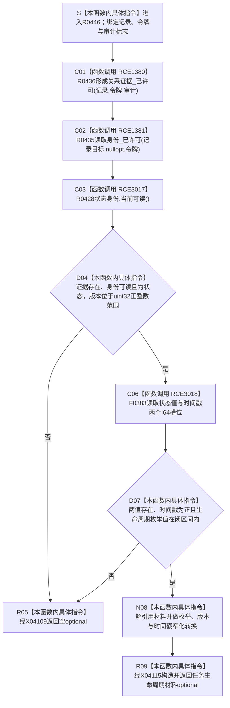

# CF-L14-0013 读取任务生命周期项已许可现状流程图

图类型：现状流程图
代码版本：`3920a74638264f9f539d50f32f3c9fe5fb1982ab`
当前工作区复核基线：`57866ac5ca63235ed12da60f635d29f1aacd718b`
源码 blob：`16ac9534baeda26ac8a712066e713f3339f6e0c8`
覆盖文件：`海中鱼巣/领域/数据操作.需求任务方法.ixx:2408-2430`
唯一根函数：R0446
完整签名：`std::optional<海中鱼巣::任务生命周期材料> 海中鱼巣::需求任务方法数据操作::读取任务生命周期项_已许可(const 海中鱼巣::关系记录& 记录, const 海中鱼巣::结构事务令牌& 令牌, bool 审计 = false) const`
参数：`记录`、`令牌` 为调用期只读借用；`审计` 按值传入并默认 `false`
返回结果：证据、目标状态身份、版本、状态值或时间戳任一不合法时返回空 optional；全部成立时返回一项任务生命周期材料
调用方：R0444（RCE1377）及已登记其它调用方
直接项目函数：R0436（RCE1380）、R0435（RCE1381）、R0428（RCE3017）、F0383（RCE3018）
符号外部边界：X04108—X04116
逐行映射表：`流程图/代码流程图/L14/CF-L14-0013_读取任务生命周期项已许可_逐行代码映射表.md`
依据提交 / 结构化消息：冻结源码提交 `3920a74638264f9f539d50f32f3c9fe5fb1982ab`；当前 `main` 复核目标源码零差异
验证输出：23 行源码完整映射；4 个项目出边、9 个外部边界、0 个未解析项目调用；本切片不运行构建或程序
依据：`规范/0050_项目通用机器逻辑与禁止性规则总纲_20260721.md`、`规范/0600_代码函数流程图应用与维护规范.md`
不得作为施工许可：是
不得宣称：返回材料已经发布任务生命周期事实、空 optional 已修复内部结构，或本函数写入了节点、关系、状态、主信息或索引

## 流程图

## 当前边界与规范核对

- 本函数只读一个关系记录及其目标状态主信息，不创建、确认、撤销或发布生命周期关系。
- 空 optional 同时承载多种读取不成立结果；调用方不得据此宣称具体根因已经修复。
