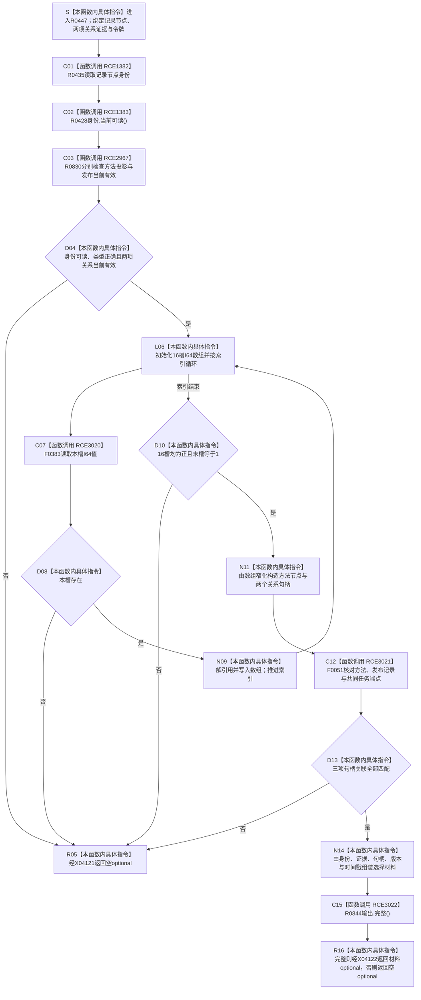

# CF-L14-0014 读取选择记录已许可现状流程图

图类型：现状流程图
代码版本：`3920a74638264f9f539d50f32f3c9fe5fb1982ab`
当前工作区复核基线：`af74e46ef3fd0b1b2c108d695569855909a59ee1`
源码 blob：`16ac9534baeda26ac8a712066e713f3339f6e0c8`
覆盖文件：`海中鱼巣/领域/数据操作.需求任务方法.ixx:2451-2489`
唯一根函数：R0447
完整签名：`std::optional<海中鱼巣::任务方法选择材料> 海中鱼巣::需求任务方法数据操作::读取选择记录_已许可(海中鱼巣::节点句柄 记录节点, const 海中鱼巣::高级关系证据& 方法投影, const 海中鱼巣::高级关系证据& 发布, const 海中鱼巣::结构事务令牌& 令牌) const`
参数：`记录节点` 按值传入；`方法投影`、`发布`、`令牌` 为调用期只读借用
返回结果：身份、关系证据、十六个 I64 槽位、句柄关联或最终材料完整性任一不成立时返回空 optional；否则返回任务方法选择材料
调用方：R0444（RCE1379）及已登记其它调用方
直接项目函数：R0435（RCE1382）、R0428（RCE1383）、R0830（RCE2967）、F0383（RCE3020）、F0051（RCE3021）、R0844（RCE3022）
符号外部边界：X04117—X04123
逐行映射表：`流程图/代码流程图/L14/CF-L14-0014_读取选择记录已许可_逐行代码映射表.md`
依据提交 / 结构化消息：冻结源码提交 `3920a74638264f9f539d50f32f3c9fe5fb1982ab`；当前 `main` 复核目标源码零差异
验证输出：39 行源码完整映射；6 个项目出边、7 个外部边界、0 个未解析项目调用；本切片不运行构建或程序
依据：`规范/0050_项目通用机器逻辑与禁止性规则总纲_20260721.md`、`规范/0600_代码函数流程图应用与维护规范.md`
不得作为施工许可：是
不得宣称：返回材料已经发布任务方法选择事实、空 optional 已修复结构，或本函数写入了节点、关系、状态、主信息或索引

## 流程图

## 当前边界与规范核对

- 本函数从记录节点、两项关系证据和十六个 I64 槽位重建值式选择材料，不写入任何关系或状态。
- `完整()` 是值式材料一致性检查；返回 true 不等于对应任务方法已经执行或发布。
