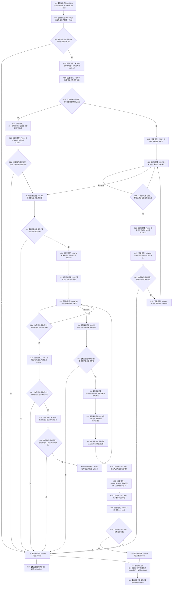

# CF-L14-0015 方法服务读取方法登记项已加锁现状流程图

代码版本：`3920a74638264f9f539d50f32f3c9fe5fb1982ab`
当前工作区复核基线：`af74e46ef3fd0b1b2c108d695569855909a59ee1`
源码 blob：`839dd462c70e8d54b6f22f1126d751ac9425398a`
图类型：现状流程图
覆盖文件：`海中鱼巣/领域/方法服务.h:1362-1424`
唯一根函数：R0477
完整签名：`std::optional<方法登记项材料> 海中鱼巣::方法服务::读取方法登记项_已加锁(节点句柄 方法首节点, const 状态服务& 状态, std::optional<关系记录> 已知登记关系 = std::nullopt) const`
参数：方法首节点值传入；状态只读借用；已知登记关系值传入且可空
返回结果：唯一登记关系、唯一合法生命周期关系和完整值式材料同时成立时返回材料 optional；否则返回 `std::nullopt`
已登记调用方：R0488
直接项目函数：F0160（RCE1454）、R0476（RCE1455）、F0575（RCE1456，两处）、R0478（RCE1457）；F0051（RCE3112，六个节点句柄比较调用点）
稳定外部边界：X04464—X04478
逐行映射表：`流程图/代码流程图/L14/CF-L14-0015_方法服务读取方法登记项已加锁_逐行代码映射表.md`
依据提交 / 结构化消息：冻结源码、当前身份表、既有项目边与本批逐行复核
验证输出：本批不运行构建或程序
不得作为施工许可：是
不得宣称：已加锁命名证明调用方持锁、登记模型符合现行目标设计或能力完成

## 节点合同

| 节点组 | 类型 | 输入 | 结果 / 后继 |
| --- | --- | --- | --- |
| C01—B03 | 函数调用 / 本函数内具体指令 | 状态、方法首节点 | 前置失败空返回 |
| X06—B11 | 函数调用 / 本函数内具体指令 | 已知登记关系、登记根材料 | 精确关系或空返回 |
| C12—X19 | 函数调用 / 本函数内具体指令 | 登记根归属关系组 | 唯一匹配登记关系 |
| X21—X30 | 函数调用 / 本函数内具体指令 | 方法首模板关系组 | 唯一合法生命周期关系 |
| X32—N37 | 函数调用 / 本函数内具体指令 | 两条已确认关系与登记根材料 | 值式登记项材料 |
| C38—R42 | 函数调用 / 本函数内具体指令 | 值式材料 | 完整则返回材料，否则空；释放局部容器和 optional |

## 关键边界

- 本函数只读关系仓库并组装值式材料，不写机器事实。
- 多条登记关系、多条生命周期关系、非法关系类型 / 端点 / 顺序号或材料不完整均折叠为逻辑内空 optional。
- 函数名含“已加锁”，但函数体不取得、验证或释放锁；持锁前置只能由调用链另行证明。
