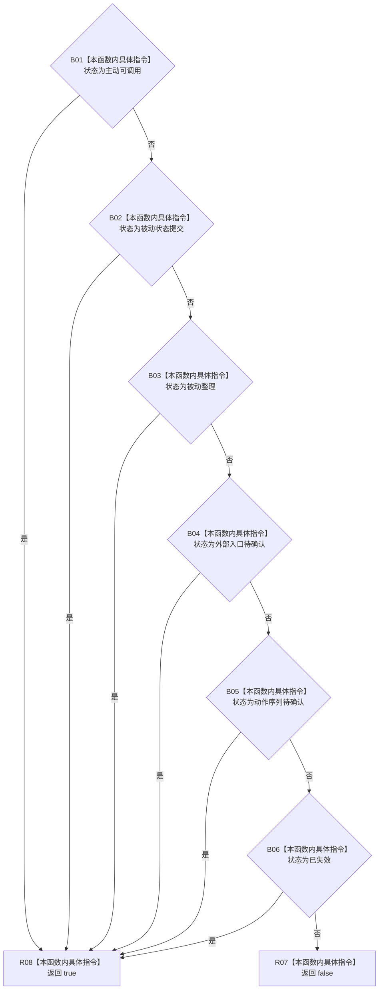

# CF-L14-0016 方法服务动作入口状态有效现状流程图

代码版本：`0a93526882cb33c61c2fbb04ecad1aeaddcfe225`
当前工作区复核基线：`ece29318f80cad2ce7a4abce9b009c60cd4cdfdd`
源码 blob：`839dd462c70e8d54b6f22f1126d751ac9425398a`
图类型：现状流程图
覆盖文件：`海中鱼巣/领域/方法服务.h:1780-1787`
唯一根函数：R0484
完整签名：`bool 海中鱼巣::方法服务::动作入口状态有效(动作入口状态 状态值) const`
参数：动作入口状态枚举值传入
返回结果：状态属于六个白名单枚举之一时返回 true，否则 false
调用图：入边 RCE1487；无项目出边
逐行映射表：`流程图/代码流程图/L14/CF-L14-0016_方法服务动作入口状态有效_逐行代码映射表.md`
输入契约 / 调用语境表：R0487 将状态仓库读出的整数转换为枚举后调用
非成功返回二分审查表：无显式中途返回；非白名单枚举返回 false
偏差清单：无关系边新增；只需校正 RCE1487 实参与返回绑定
依据提交 / 结构化消息：冻结源码、当前调用关系与逐行复核
验证输出：本批不运行构建或程序
不得作为施工许可：是
不得宣称：六状态白名单符合现行目标状态机

## 节点合同

| 节点组 | 类型 | 输入 | 结果 / 后继 |
| --- | --- | --- | --- |
| B01—B06 | 本函数内具体指令 | 状态值 | 按源码顺序短路匹配六个枚举 |
| R07 / R08 | 本函数内具体指令 | 合取结果 | 返回 false / true |

## 关键边界

- 本函数是纯枚举白名单判断，不读取或写入任何仓库。
- 未设置、未知枚举值及不在六项中的值均返回 false。
