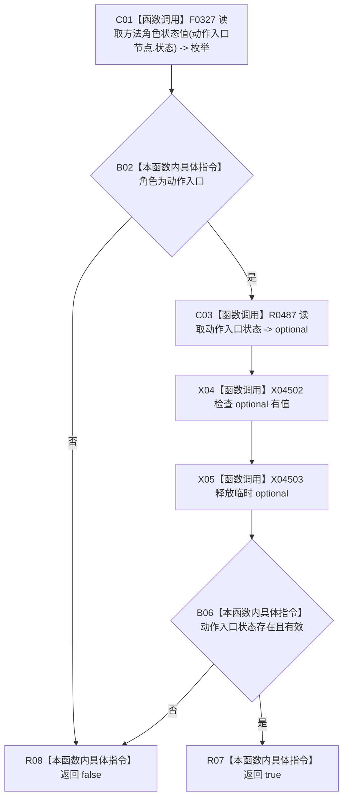

# CF-L14-0017 方法服务有效动作入口角色现状流程图

代码版本：`0a93526882cb33c61c2fbb04ecad1aeaddcfe225`
当前工作区复核基线：`ece29318f80cad2ce7a4abce9b009c60cd4cdfdd`
源码 blob：`839dd462c70e8d54b6f22f1126d751ac9425398a`
图类型：现状流程图
覆盖文件：`海中鱼巣/领域/方法服务.h:1806-1809`
唯一根函数：R0485
完整签名：`bool 海中鱼巣::方法服务::有效动作入口角色(节点句柄 动作入口节点, const 状态服务& 状态) const`
参数：动作入口节点值传入；状态只读借用
返回结果：节点角色为动作入口且可读取到有效动作入口状态时返回 true，否则 false
调用图：入边 RCE1482；出边 RCE1479、RCE1480
逐行映射表：`流程图/代码流程图/L14/CF-L14-0017_方法服务有效动作入口角色_逐行代码映射表.md`
输入契约 / 调用语境表：R0486 对候选动作入口节点调用
非成功返回二分审查表：无显式中途返回；角色或状态无效时短路 false
偏差清单：新增 R0487 临时 optional 的 has_value 与析构边界建议
依据提交 / 结构化消息：冻结源码、当前调用关系与逐调用点复核
验证输出：本批不运行构建或程序
不得作为施工许可：是
不得宣称：动作入口角色合同符合现行目标设计

## 节点合同

| 节点组 | 类型 | 输入 | 结果 / 后继 |
| --- | --- | --- | --- |
| C01 / B02 | 函数调用 / 本函数内具体指令 | 动作入口节点、状态 | 非动作入口角色直接 false |
| C03—B06 | 函数调用 / 本函数内具体指令 | 动作入口节点、状态 | 读取并检查状态 optional |
| R07 / R08 | 本函数内具体指令 | 短路合取结果 | 返回 bool |

## 关键边界

- 本函数只读角色和动作入口状态；不检查该节点与某个方法首的引用关系。
- R0486 在外层继续核对方法首、节点互异和引用关系。
