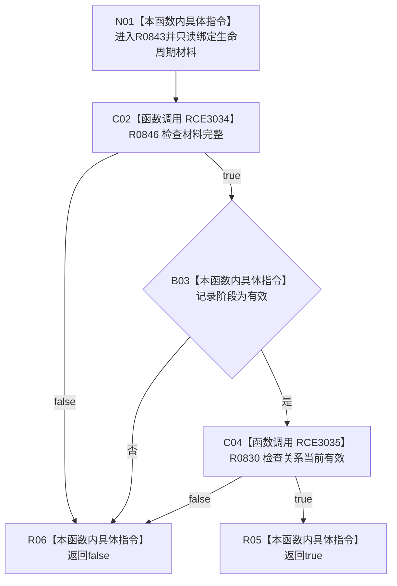

# CF-L14-0018 任务生命周期材料当前现状流程图

图类型：现状流程图
代码版本：`03a8b7ac099ccea83e57f2696e2290b7bcdfacaf`
当前工作区复核基线：`4e0ac10ae3b18404ff2b623faa0fb006fa0fc7a1`
源码 blob：`16ac9534baeda26ac8a712066e713f3339f6e0c8`
覆盖文件：`海中鱼巣/领域/数据操作.需求任务方法.ixx:223-225`
唯一根函数：R0843
完整签名：`bool 海中鱼巣::任务生命周期材料::当前() const noexcept`
参数：无显式参数；只读生命周期材料
返回结果：材料完整、记录有效且关系当前有效时返回 true，否则 false
调用图：`流程图/主程序可达调用关系/00_main可达函数身份表.md`、`01_main可达项目调用边表.md`、`02_main可达外部边界表.md`
已登记调用方：R0444、R0840（RCE3336）
直接项目函数：R0846（RCE3034）、R0830（RCE3035）
外部边界：无
逐行映射表：`流程图/代码流程图/L14/CF-L14-0018_任务生命周期材料当前_逐行代码映射表.md`
不得作为施工许可：是
不得宣称：当前分类证明生命周期已经独立读回或发布

## 流程图

## 当前边界

- 本函数不读取仓库，只组合材料完整性、记录状态和关系当前性。
