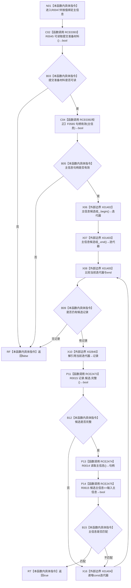

# CF-L15-0001 结构写入会话判断主信息候选提交准备现状流程图

图类型：现状流程图
代码版本：`64a2d63eca4a76b7282f3f8807aa6fea5b0f66a1`
源码事实提交：`3920a74638264f9f539d50f32f3c9fe5fb1982ab`
源码 blob：`df70de9c299c74f7f0766a3e94facaf504f57968`
覆盖文件：`海中鱼巣/核心/会话.结构写入.ixx:749-755`
唯一根函数：R0047
完整签名：`bool 海中鱼巣::结构写入会话::主信息是本会话候选_提交准备(海中鱼巣::主信息句柄 主信息) const`
参数：主信息按值传入；隐式 `this` 为 const 非拥有借用
返回结果：提交准备可读、主信息句柄有效，且候选组存在完整并匹配的主信息候选时返回 true，否则返回 false
已登记调用方：R0016/R0051，经 RCE0326/RCE0398
直接项目函数：RCE0393→R0045、RCE0392→F0565、RCE2473→R0015、RCE2474→R0014、RCE2475→R0615
外部边界：X01402—X01405、X02840
未解析项目调用：0
逐行映射表：`流程图/代码流程图/L15/CF-L15-0001_结构写入会话判断主信息候选提交准备_逐行代码映射表.md`
结构读取与写入：只读会话提交准备状态和主信息候选组，零结构变化
验证输出：749—755 行完整映射；2 条项目入边、5 条项目出边、5 个外部边界
不得作为施工许可：是
不得宣称：返回 true 证明候选已发布、已提交或仓库读取已经完成

## 流程图

## 当前边界

- RCE0393：`this=this`，返回 bool 是入口短路第一项。
- RCE0392 的调用点和 ID 稳定，但 callee 必须从 F0168 校正为主信息句柄重载 F0565；实参 `主信息=主信息`，返回 bool 是入口短路第二项。
- RCE2473：`this=&记录.候选`，返回 bool 为候选匹配短路第一项；RCE2474 同一 `this` 返回主信息句柄；RCE2475 以读取句柄和输入主信息为左右实参，返回 bool 直接决定匹配分支。
- X01402—X01405 分别承担 const `begin`、const `end`、前置递增和范围比较；X02840 以当前 const 迭代器为 `this`，返回 `const 主信息候选记录&`。
