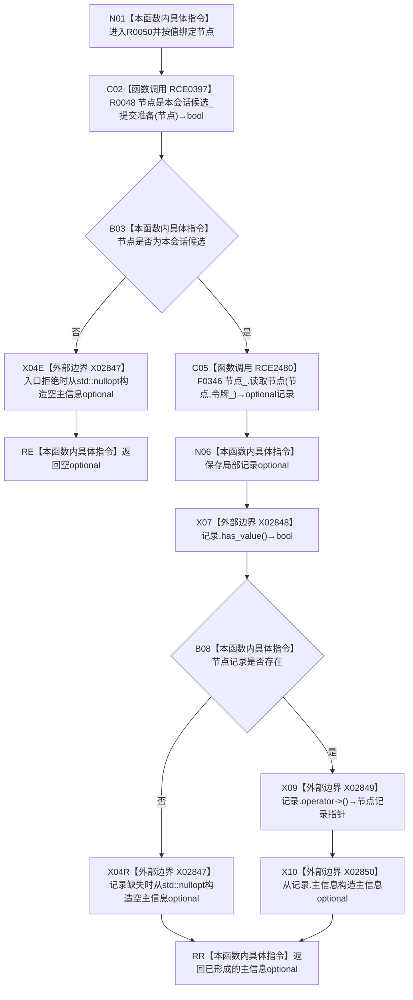

# CF-L15-0004 结构写入会话读取候选节点主信息提交准备现状流程图

图类型：现状流程图
代码版本：`64a2d63eca4a76b7282f3f8807aa6fea5b0f66a1`
源码事实提交：`3920a74638264f9f539d50f32f3c9fe5fb1982ab`
源码 blob：`df70de9c299c74f7f0766a3e94facaf504f57968`
覆盖文件：`海中鱼巣/核心/会话.结构写入.ixx:771-775`
唯一根函数：R0050
完整签名：`std::optional<海中鱼巣::主信息句柄> 海中鱼巣::结构写入会话::读取候选节点主信息_提交准备(海中鱼巣::节点句柄 节点) const`
参数：节点按值传入；隐式 `this` 为 const 非拥有借用
返回结果：节点不是本会话候选或令牌读取不到记录时返回空 optional；记录存在时返回其主信息句柄
已登记调用方：R0019 经 RCE0329
直接项目函数：RCE0397→R0048、RCE2480→F0346
外部边界：X02847—X02850
未解析项目调用：0
逐行映射表：`流程图/代码流程图/L15/CF-L15-0004_结构写入会话读取候选节点主信息提交准备_逐行代码映射表.md`
结构读取与写入：只读会话候选资格和令牌下节点记录，零结构变化
验证输出：771—775 行完整映射；1 条项目入边、2 条项目出边、4 个外部边界
不得作为施工许可：是
不得宣称：空 optional 能区分非本会话候选、令牌拒绝、节点缺失或版本漂移

## 流程图

## 当前边界

- RCE0397：`this=this`、`节点=节点`，返回 bool 被取反用于入口早退。
- RCE2480：`this=&节点_`、`节点=节点`、`令牌=令牌_`，返回绑定局部 `记录`；仅在 RCE0397 返回 true 时可达。
- X02847 在 772、774 行共调用两次候选位置，调用次数为 2。
