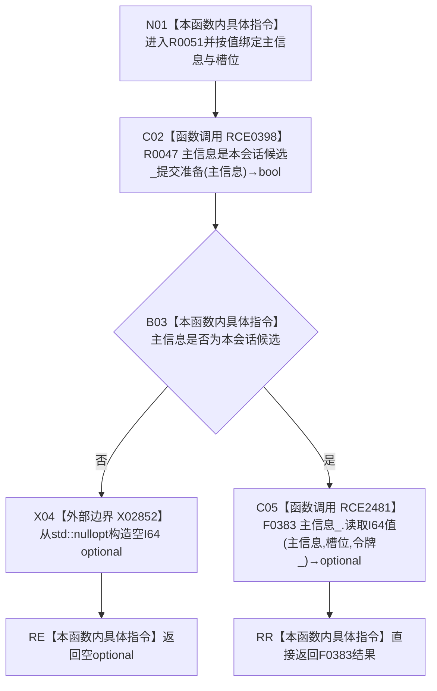

# CF-L15-0005 结构写入会话读取候选 I64 值提交准备现状流程图

图类型：现状流程图
代码版本：`64a2d63eca4a76b7282f3f8807aa6fea5b0f66a1`
源码事实提交：`3920a74638264f9f539d50f32f3c9fe5fb1982ab`
源码 blob：`df70de9c299c74f7f0766a3e94facaf504f57968`
覆盖文件：`海中鱼巣/核心/会话.结构写入.ixx:777-782`
唯一根函数：R0051
完整签名：`std::optional<std::int64_t> 海中鱼巣::结构写入会话::读取候选I64值_提交准备(海中鱼巣::主信息句柄 主信息, std::uint64_t 槽位) const`
参数：主信息和槽位均按值传入；隐式 `this` 为 const 非拥有借用
返回结果：主信息不是本会话候选时返回空 optional；否则返回令牌下 F0383 的 I64 槽位读取结果
已登记调用方：R0020 经 RCE0330
直接项目函数：RCE0398→R0047、RCE2481→F0383
外部边界：X02852 `std::optional<std::int64_t>::optional(std::nullopt_t)`
未解析项目调用：0
逐行映射表：`流程图/代码流程图/L15/CF-L15-0005_结构写入会话读取候选I64值提交准备_逐行代码映射表.md`
结构读取与写入：只读会话候选资格和令牌下主信息 I64 槽位，零结构变化
验证输出：777—782 行完整映射；1 条项目入边、2 条项目出边、1 个外部边界
不得作为施工许可：是
不得宣称：空 optional 能区分非本会话候选、槽位无值、令牌拒绝或版本漂移

## 流程图

## 当前边界

- RCE0398：`this=this`、`主信息=主信息`，返回 bool 被取反用于入口早退。
- RCE2481：`this=&主信息_`、`主信息=主信息`、`值索引=槽位`、`令牌=令牌_`，返回 optional 直接绑定根函数返回值；仅在 RCE0398 返回 true 时可达。
