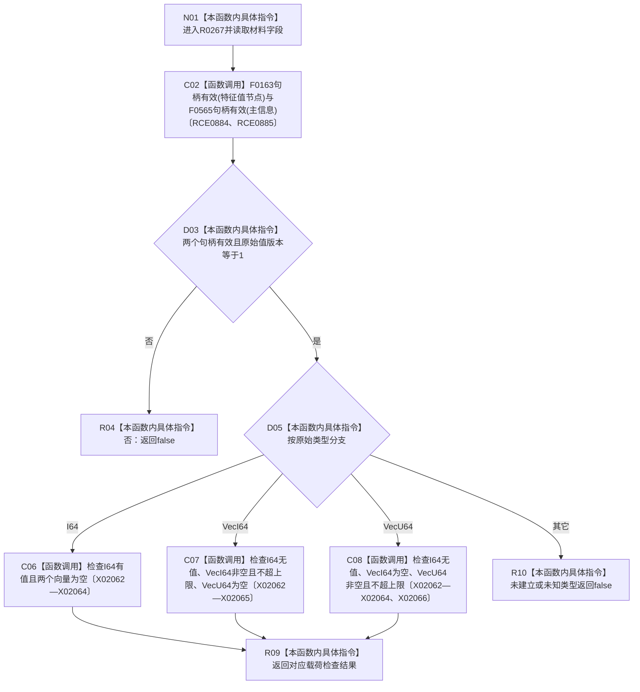

# CF-L15-0006 特征值初始原始材料字段自洽现状流程图

图类型：现状流程图
代码版本：`3920a74638264f9f539d50f32f3c9fe5fb1982ab`
源码 blob：`d82fa092a2c1156d2f8de758d5e32415cb64931d`
覆盖文件：`海中鱼巣/领域/参与者.特征值原始材料.ixx:30-44`
唯一根函数：R0267
完整签名：`bool 海中鱼巣::特征值初始原始材料::字段自洽() const`
参数：无显式参数；只读当前材料字段
返回结果：身份、版本、原始类型及唯一载荷形态全部自洽时返回 `true`，否则返回 `false`
已登记调用方：R0270（RCE0887）
直接项目函数：F0163（RCE0884）、F0565（RCE0885）
外部边界：X02062—X02066；未解析项目调用：0
调用图：`流程图/主程序可达调用关系/01_main可达项目调用边表.md`
逐行映射表：`流程图/代码流程图/L15/CF-L15-0006_特征值初始原始材料字段自洽_逐行代码映射表.md`
偏差清单：无
依据：RCE0884、RCE0885、RCE0887、X02062—X02066 与冻结源码
结构读取与写入：只读材料字段，不改变结构
逻辑内返回：任一自洽条件不满足时返回 `false`
不得作为施工许可：是
不得宣称：材料已登记、已准备或已发布

## 流程图

## 当前边界

- 三种原始载荷互斥；序列类型还受最大元素数量限制。
